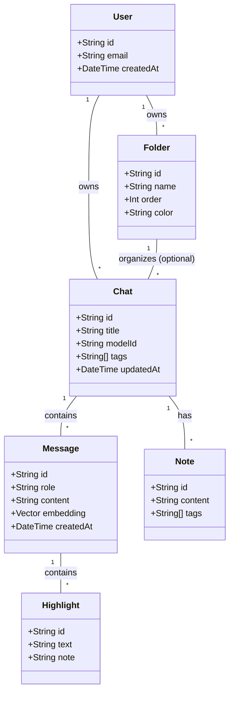
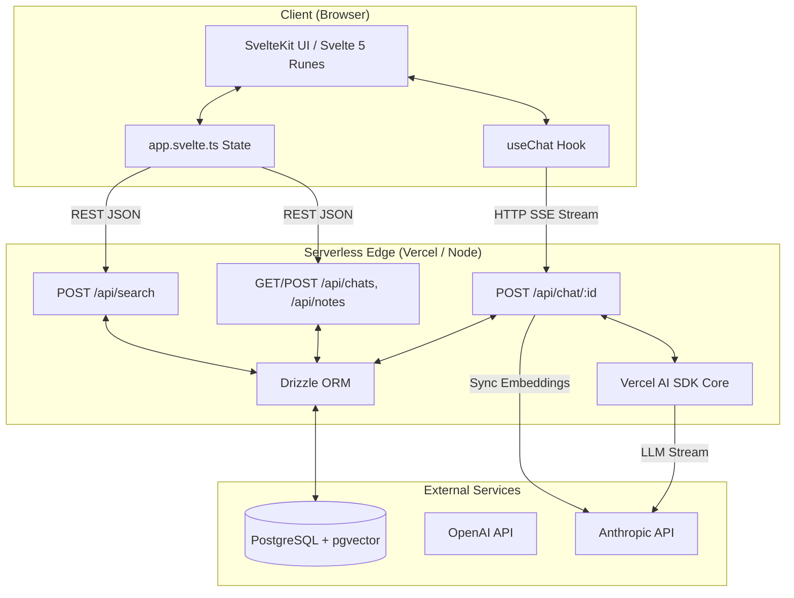
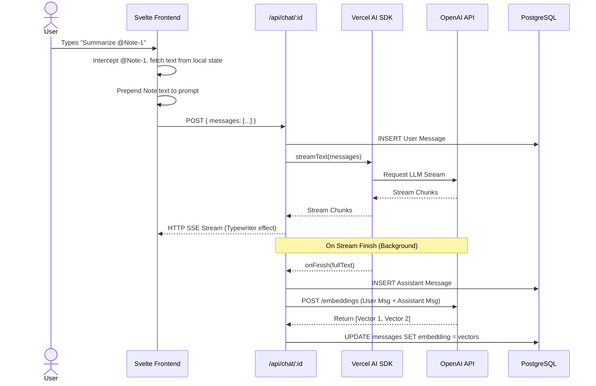

**Project:** BetterChatGPT (AI-Powered Personal Knowledge Management)

**Document:** Domain Understanding & Architecture Overview

**Version:** 1.1 (Lean V1 + Cloning)

---

## 1. Domain Understanding

### 1.1. Domain Glossary (Ubiquitous Language)
To ensure clear communication across the engineering team, the following terms have strict definitions within this system:

*   **Chat:** A linear sequence of messages between a user and an AI model. It acts as the primary container for a specific conversation or task.
*   **Message:** A single turn in a Chat. Must have a `role` (`user`, `assistant`, or `system`).
*   **Folder:** A flat organizational container for Chats. (Note: Folders cannot contain other Folders).
*   **Highlight:** A specific text string extracted from an AI's Message, saved for future reference.
*   **Note (Scratchpad):** A user-authored markdown document attached to a Chat, used to summarize or synthesize AI outputs.
*   **Clone (Forking):** The act of duplicating a Chat up to a specific Message. This creates a new, independent Chat, allowing the user to explore an alternate conversation path without altering the original.
*   **Context Injection (`@` Mention):** A frontend mechanism where a user references a past Chat or Note. The system invisibly prepends the referenced text to the user's prompt before sending it to the AI.
*   **Embedding:** A mathematical vector representation (1536 dimensions) of a Message's text, used to power semantic search.

### 1.2. Business Rules and Constraints
*   **Folder Hierarchy:** Folders are strictly one-level deep. A Chat can belong to one Folder or no Folder.
*   **Cascading Deletions:** Deleting a Chat permanently deletes all its Messages, Notes, and Highlights. Deleting a Message deletes its Highlights.
*   **Cloning Integrity:** When a Chat is cloned at Message *N*, the new Chat receives exact copies of Messages 1 through *N*, including their vector embeddings (to save API costs). Notes and Highlights are *not* cloned.
*   **Destructive Regeneration:** If a user edits Message *N* and clicks "Regenerate", Messages *N+1* and beyond are permanently deleted from that Chat before the new AI response is generated.
*   **Tagging:** Tags are stored as flat JSONB string arrays on Chats and Notes. There is no centralized "Tag Management" table.

### 1.3. Domain Model & Entity Relationships

### 1.4. Core Business Processes and Workflows

1.  **The Chat Generation Loop:**
    *   User submits a prompt.
    *   Frontend generates a `cuid2` ID and optimistically renders the user message.
    *   Backend receives the prompt, triggers the AI Provider via Vercel AI SDK.
    *   Backend streams the response chunks to the frontend.
    *   On stream completion, backend saves the final AI message to the DB and synchronously generates its vector embedding.
2.  **The Knowledge Extraction Flow:**
    *   User highlights text in a completed AI message.
    *   Frontend displays a tooltip: "Save Highlight".
    *   User clicks save; frontend optimistically adds it to the Secondary Panel.
    *   Backend persists the Highlight linked to the specific `messageId`.
3.  **The Branching (Clone) Flow:**
    *   User clicks "Clone up to here" on Message 5 of a 10-message chat.
    *   Backend executes an `INSERT INTO ... SELECT` SQL command, duplicating the Chat and Messages 1-5 (including vectors).
    *   Frontend redirects the user to the newly created Chat ID.

---

## 2. Architecture Overview

### 2.1. System Architecture Diagram

### 2.2. Component Interaction Patterns

*   **Optimistic UI via CUID2:** The frontend generates all primary keys (`cuid2`) before making network requests. When a user creates a folder, it appears instantly in the UI. The network request happens in the background. If it fails, the UI rolls back the state and shows a Toast error.
*   **Frontend Context Injection:** The backend API is kept "dumb" regarding `@` mentions. If a user types `@Chat-123`, the Svelte frontend fetches the text of `Chat-123` from its local state, wraps it in `<context>` XML tags, and prepends it to the user's prompt before sending it to the `/api/chat` endpoint.
*   **Server-Sent Events (SSE):** We do not use WebSockets. The Vercel AI SDK establishes an HTTP SSE connection. This is firewall-friendly, natively supported by browsers, and perfectly suited for serverless environments where long-lived WebSocket connections are killed.

### 2.3. Technology Stack Decisions and Rationale

| Technology | Decision Rationale (Why?) |
| :--- | :--- |
| **SvelteKit v5** | Svelte 5's Runes (`$state`, `$derived`) eliminate the boilerplate of traditional stores. It provides the fastest DOM updates for complex, highly-reactive chat interfaces. |
| **Drizzle ORM** | Provides end-to-end TypeScript safety. Unlike Prisma, Drizzle uses SQL-like syntax and doesn't require a heavy Rust binary, making it significantly faster in serverless edge functions. |
| **pgvector** | Allows us to store vector embeddings directly alongside our relational data in PostgreSQL. This eliminates the need (and cost) of a separate vector database like Pinecone. |
| **Vercel AI SDK** | Normalizes the streaming protocols of OpenAI, Anthropic, and Google into a single, unified API. Saves hundreds of hours of writing custom stream parsers. |
| **CUID2** | Standard UUIDs are bulky and not URL-friendly. CUID2 generates short, secure, collision-resistant strings that can be safely generated on the client side for optimistic UI. |

### 2.4. Integration Points with External Systems

1.  **OpenAI API (`api.openai.com`):**
    *   *Purpose:* LLM Generation (`gpt-4o`, `gpt-4o-mini`) and Vector Embeddings (`text-embedding-3-small`).
    *   *Auth:* `OPENAI_API_KEY` environment variable.
2.  **Anthropic API (`api.anthropic.com`):**
    *   *Purpose:* Alternative LLM Generation (`claude-3-5-sonnet`).
    *   *Auth:* `ANTHROPIC_API_KEY` environment variable.
3.  **PostgreSQL Database:**
    *   *Purpose:* Primary data store. Must have the `pgvector` extension enabled.
    *   *Auth:* `DATABASE_URL` connection string.

### 2.5. Data Flow Diagram: Message Generation & Embedding

This sequence diagram illustrates the exact data flow when a user sends a message containing an `@` mention.

