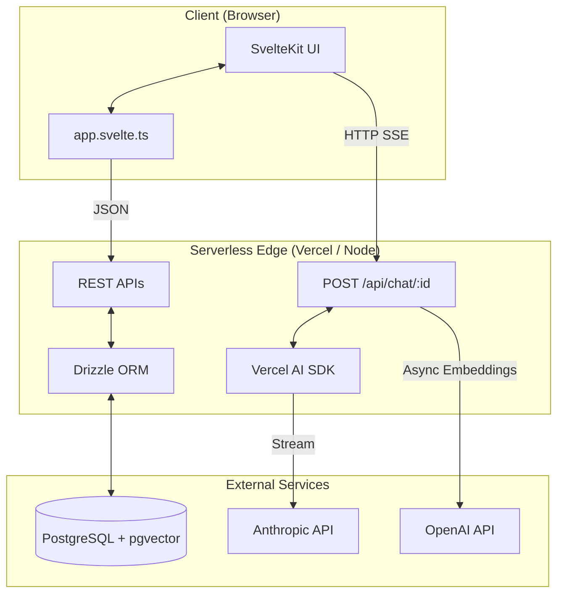
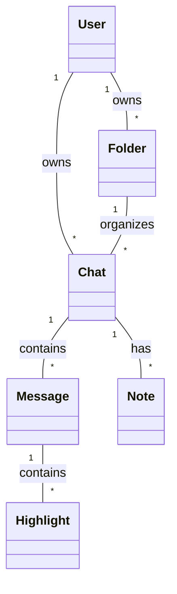

**Project:** BetterChatGPT
**Document:** System Architecture & Data Contracts

---

## 1. System Architecture Diagram

## 2. Domain Model & Database Schema
*   **Tech:** PostgreSQL, Drizzle ORM, `pgvector`.
*   **Primary Keys:** `cuid2` (`varchar(32)`).
*   **Tenant Isolation:** Pre-auth uses `getDefaultUserId()`. All queries must filter by `userId`.
*   **Cascades:** Deleting a Chat cascades to Messages, Notes, and Highlights.

## 3. Core Business Logic & System Limits
*   **Auto-Title:** Triggered asynchronously on the first AI response completion using `claude-haiku-4-5-20251001`. Updates `chats.title` directly.
*   **Vector Embeddings:** Generated synchronously via OpenAI `text-embedding-3-small` on message completion. Max token limit: 8,191 tokens. Skipped if `OPENAI_API_KEY` is missing.
*   **Semantic Search:** Uses `pgvector` cosine distance (`<=>`) against `messages.embedding`.
*   **Message Limits:** System is designed for 15-20 messages per chat. No pagination is implemented.

## 4. API Contracts
*   `POST /api/chat/:chatId`: Expects `{ messages: [...] }`. Returns HTTP SSE stream.
*   `GET /api/chats/:chatId/messages`: Returns all messages for a chat (no cursor/limit needed).
*   `POST /api/chats`, `PATCH /api/chats/:id`, `DELETE /api/chats/:id`: Standard CRUD.
*   `POST /api/folders`, `PATCH /api/folders/:id`, `DELETE /api/folders/:id`: Standard CRUD.
*   `POST /api/notes`, `PATCH /api/notes/:id`, `DELETE /api/notes/:id`: Standard CRUD.
*   `POST /api/highlights`, `DELETE /api/highlights/:id`: Standard CRUD.
*   `GET /api/chats/:id/highlights`: Returns all highlights for a chat.
*   `POST /api/search`: Expects `{ query, limit }`. Returns array of matching messages with cosine score.
*   `POST /api/chats/:id/clone`: Expects `{ upToMessageId }`. Copies chat + messages up to and including that message into a new chat (title suffixed `(clone)`). Returns new Chat object.
*   `DELETE /api/chats/:id/messages/after`: Expects `{ messageId, inclusive? }`. `inclusive=false` (default) deletes messages after the pivot; `inclusive=true` deletes the pivot and everything after. Returns `{ deleted: number }`.
