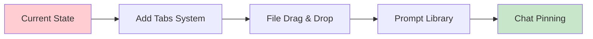
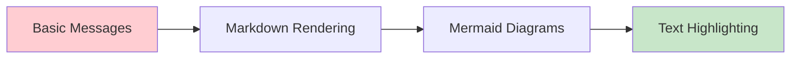
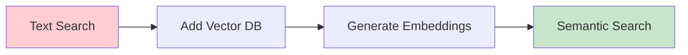

I'll analyze your current implementation and provide a clear architectural diagram for your ChatAI application.

## Current Implementation Analysis

### ✅ **Implemented Features:**
1. **Chat Management**
   - Basic chat storage and display
   - Chat creation
   - Chat history list
   - Current chat tracking

2. **Folder Organization**
   - Folder creation and management
   - Folder colors
   - Expand/collapse folders
   - Drag-and-drop reordering (folders & chats)

3. **UI Components**
   - Sidebar with menu
   - Search functionality
   - Responsive layout
   - Theme system (DaisyUI)

4. **Data Layer**
   - Svelte stores for state management
   - Database schema (Drizzle ORM)
   - TypeScript types

### ❌ **Missing Features (Based on Your Needs):**
1. **Tabs** - No tab system for multiple active chats
2. **File Attachments** - No drag-and-drop file support
3. **Pinning** - No chat pinning mechanism
4. **Highlighting** - No text highlighting in chat content
5. **Prompt Library** - No saved prompts/templates
6. **Semantic Search** - Basic text search only (no embeddings)
7. **Markdown/Mermaid Rendering** - Not visible in current code
8. **File References** - No file attachment or reference system

## Suggested Architecture

```mermaid
graph TB
    subgraph "Presentation Layer"
        UI[UI Components]
        UI --> Layout[Layout Components]
        UI --> Chat[Chat Components]
        UI --> Prompt[Prompt Library]
        UI --> Search[Search Interface]
        
        Layout --> Header[Header + Tabs]
        Layout --> Sidebar[Sidebar + Menu]
        Layout --> Main[Main Chat Area]
        
        Chat --> History[Chat History]
        Chat --> Message[Message Display]
        Chat --> Composer[Message Composer]
        Chat --> Attachments[File Attachments]
        
        Message --> Markdown[Markdown Renderer]
        Message --> Mermaid[Mermaid Renderer]
        Message --> Highlight[Text Highlighter]
    end
    
    subgraph "Application Layer"
        Stores[Svelte Stores]
        Stores --> ChatStore[Chat Store]
        Stores --> FolderStore[Folder Store]
        Stores --> UIStore[UI Store]
        Stores --> TabStore[Tab Store]
        Stores --> PromptStore[Prompt Store]
        Stores --> FileStore[File Store]
    end
    
    subgraph "Domain Layer"
        Models[Domain Models]
        Models --> ChatModel[Chat]
        Models --> MessageModel[Message]
        Models --> FolderModel[Folder]
        Models --> PromptModel[Prompt Template]
        Models --> FileModel[File Reference]
        Models --> HighlightModel[Highlight]
    end
    
    subgraph "Data Layer"
        API[API Layer]
        DB[(Database)]
        Vector[(Vector DB)]
        Storage[(File Storage)]
        
        API --> ChatAPI[Chat API]
        API --> SearchAPI[Search API]
        API --> FileAPI[File API]
        API --> EmbedAPI[Embedding API]
        
        ChatAPI --> DB
        SearchAPI --> Vector
        FileAPI --> Storage
        EmbedAPI --> Vector
    end
    
    UI --> Stores
    Stores --> Models
    Models --> API
    
    style UI fill:#e1f5ff
    style Stores fill:#fff3e0
    style Models fill:#f3e5f5
    style API fill:#e8f5e9
```



## Simplified Implementation Roadmap

### **Phase 1: Core Missing Features** (Priority)


### **Phase 2: Content Enhancement**


### **Phase 3: Advanced Search**


## Recommended Data Structure Extensions

```typescript
// Add to chat.ts
export interface FileReference {
  id: string;
  name: string;
  type: string;
  size: number;
  url: string;
  uploadedAt: Date;
}

export interface Highlight {
  id: string;
  messageId: string;
  text: string;
  color: string;
  note?: string;
}

export interface PromptTemplate {
  id: string;
  title: string;
  content: string;
  category?: string;
  tags: string[];
}

export interface Tab {
  id: string;
  chatId: string;
  title: string;
  isPinned: boolean;
  order: number;
}

export interface Message {
  role: 'user' | 'assistant' | 'system';
  content: string;
  attachments?: FileReference[]; // NEW
  highlights?: Highlight[]; // NEW
  timestamp: Date; // NEW
}
```

## Key Architectural Principles

1. **Keep It Simple**: Don't overcomplicate - add features incrementally
2. **Separation of Concerns**: UI → Stores → API → Database
3. **Composition**: Build complex features from simple components
4. **Progressive Enhancement**: Start with basic versions, enhance later

## Next Steps Priority

1. **Implement Tab System** - Most impactful for multi-chat workflow
2. **Add File Attachments** - Essential for reference-based chats
3. **Create Prompt Library** - Improve writing efficiency
4. **Markdown/Mermaid Rendering** - Core content feature
5. **Text Highlighting** - Research enhancement
6. **Semantic Search** - Advanced feature (later phase)

Would you like me to help implement any specific feature from this roadmap?