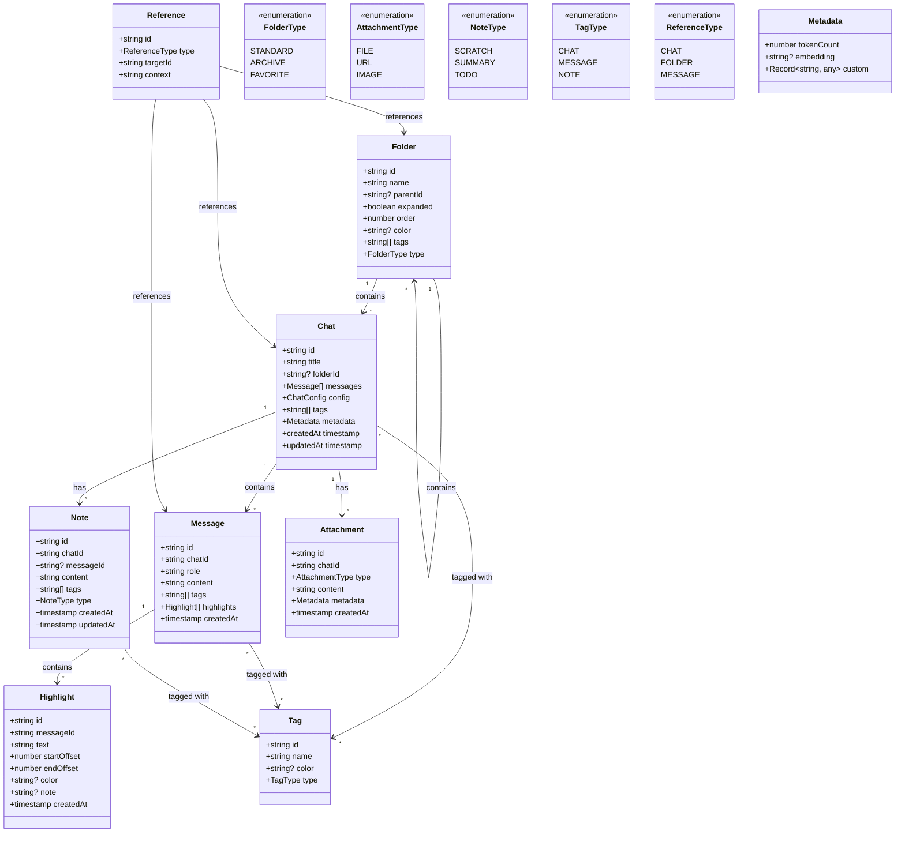
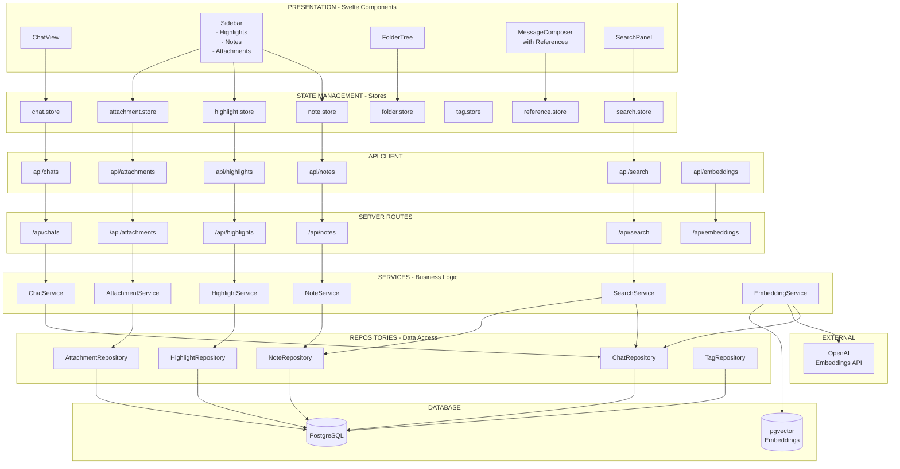

Act as commercial grade SvelteKit v5 developer and TypesScript expert.

Here are propose changes and details are in api_contracts.md
Please carry one implementation step by step along with minimalistic UTs (Vitest) to prove implementation works.

📊 Update Domain Model

🏗️ Architecture Layers

