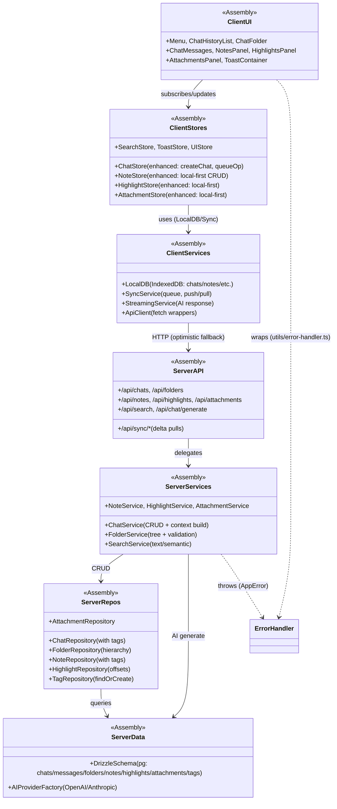

```mermaid
classDiagram
    direction TB
    %% Client Components
    class ClientUI {
        <<Assembly>>
        +Menu, ChatHistoryList, ChatFolder
        +ChatMessages, NotesPanel, HighlightsPanel
        +AttachmentsPanel, ToastContainer
    }
    class ClientStores {
        <<Assembly>>
        +ChatStore (enhanced: createChat, queueOp)
        +NoteStore (enhanced: local-first CRUD)
        +HighlightStore (enhanced: local-first)
        +AttachmentStore (enhanced: local-first)
        +SearchStore, ToastStore, UIStore
    }
    class ClientServices {
        <<Assembly>>
        +LocalDB (IndexedDB: chats/notes/etc.)
        +SyncService (queue, push/pull)
        +StreamingService (AI response)
        +ApiClient (fetch wrappers)
    }

    %% Server Components
    class ServerAPI {
        <<Assembly>>
        +/api/chats, /api/folders
        +/api/notes, /api/highlights, /api/attachments
        +/api/search, /api/chat/generate
        +/api/sync/* (delta pulls)
    }
    class ServerServices {
        <<Assembly>>
        +ChatService (CRUD + context build)
        +FolderService (tree + validation)
        +NoteService, HighlightService, AttachmentService
        +SearchService (text/semantic)
    }
    class ServerRepos {
        <<Assembly>>
        +ChatRepository (with tags)
        +FolderRepository (hierarchy)
        +NoteRepository (with tags)
        +HighlightRepository (offsets)
        +AttachmentRepository
        +TagRepository (findOrCreate)
    }
    class ServerData {
        <<Assembly>>
        +DrizzleSchema (pg: chats/messages/folders/notes/highlights/attachments/tags)
        +AIProviderFactory (OpenAI/Anthropic)
    }

    %% Dependencies (Client)
    ClientUI --> ClientStores : subscribes/updates
    ClientStores --> ClientServices : uses (LocalDB/Sync)
    ClientServices --> ServerAPI : HTTP (optimistic fallback)

    %% Dependencies (Server)
    ServerAPI --> ServerServices : delegates
    ServerServices --> ServerRepos : CRUD
    ServerRepos --> ServerData : queries
    ServerServices --> ServerData : AI generate

    %% Cross-Cutting
    ClientUI ..> ErrorHandler : wraps (utils/error-handler.ts)
    ServerServices ..> ErrorHandler : throws (AppError)
```