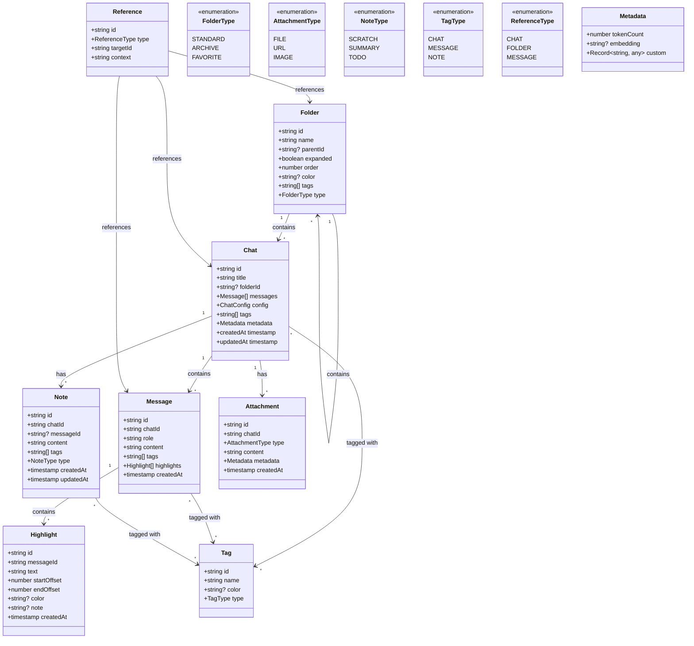

Act as commercial grade SvelteKit v5 developer and TypesScript expert.


Here are propose changes and details are in api_contracts.md
Please carry one implementation step by step along with minimalistic UTs (Vitest) to prove implementation works.

📊 Update Domain Model

```mermaid

classDiagram
    %% ============================================
    %% CORE DOMAIN ENTITIES
    %% ============================================
    class Chat {
        +string id
        +string title
        +string? folderId
        +Message[] messages
        +ChatConfig config
        +string[] tags
        +Metadata metadata
        +createdAt timestamp
        +updatedAt timestamp
    }

    class Folder {
        +string id
        +string name
        +string? parentId
        +boolean expanded
        +number order
        +string? color
        +string[] tags
        +FolderType type
    }

    class Message {
        +string id
        +string chatId
        +string role
        +string content
        +string[] tags
        +Highlight[] highlights
        +timestamp createdAt
    }

    class Note {
        +string id
        +string chatId
        +string? messageId
        +string content
        +string[] tags
        +NoteType type
        +timestamp createdAt
        +timestamp updatedAt
    }

    class Highlight {
        +string id
        +string messageId
        +string text
        +number startOffset
        +number endOffset
        +string? color
        +string? note
        +timestamp createdAt
    }

    class Attachment {
        +string id
        +string chatId
        +AttachmentType type
        +string content
        +Metadata metadata
        +timestamp createdAt
    }

    class Tag {
        +string id
        +string name
        +string? color
        +TagType type
    }

    class Reference {
        +string id
        +ReferenceType type
        +string targetId
        +string context
    }

    %% ============================================
    %% ENUMS & VALUE OBJECTS
    %% ============================================
    class FolderType {
        <<enumeration>>
        STANDARD
        ARCHIVE
        FAVORITE
    }

    class AttachmentType {
        <<enumeration>>
        FILE
        URL
        IMAGE
    }

    class NoteType {
        <<enumeration>>
        SCRATCH
        SUMMARY
        TODO
    }

    class TagType {
        <<enumeration>>
        CHAT
        MESSAGE
        NOTE
    }

    class ReferenceType {
        <<enumeration>>
        CHAT
        FOLDER
        MESSAGE
    }

    class Metadata {
        +number tokenCount
        +string? embedding
        +Record~string, any~ custom
    }

    %% ============================================
    %% RELATIONSHIPS
    %% ============================================
    Folder "1" --> "*" Chat : contains
    Folder "1" --> "*" Folder : contains
    Chat "1" --> "*" Message : contains
    Chat "1" --> "*" Note : has
    Chat "1" --> "*" Attachment : has
    Chat "*" --> "*" Tag : tagged with
    Message "1" --> "*" Highlight : contains
    Message "*" --> "*" Tag : tagged with
    Note "*" --> "*" Tag : tagged with
    Reference --> Chat : references
    Reference --> Folder : references
    Reference --> Message : references
```

🏗️ Architecture Layers

```mermaid
graph TB
    subgraph "PRESENTATION - Svelte Components"
        A1[ChatView]
        A2[Sidebar<br/>- Highlights<br/>- Notes<br/>- Attachments]
        A3[FolderTree]
        A4[MessageComposer<br/>with References]
        A5[SearchPanel]
    end

    subgraph "STATE MANAGEMENT - Stores"
        B1[chat.store]
        B2[folder.store]
        B3[note.store]
        B4[highlight.store]
        B5[attachment.store]
        B6[tag.store]
        B7[reference.store]
        B8[search.store]
    end

    subgraph "API CLIENT"
        C1[api/chats]
        C2[api/notes]
        C3[api/highlights]
        C4[api/attachments]
        C5[api/search]
        C6[api/embeddings]
    end

    subgraph "SERVER ROUTES"
        D1[/api/chats]
        D2[/api/notes]
        D3[/api/highlights]
        D4[/api/attachments]
        D5[/api/search]
        D6[/api/embeddings]
    end

    subgraph "SERVICES - Business Logic"
        E1[ChatService]
        E2[NoteService]
        E3[HighlightService]
        E4[AttachmentService]
        E5[SearchService]
        E6[EmbeddingService]
    end

    subgraph "REPOSITORIES - Data Access"
        F1[ChatRepository]
        F2[NoteRepository]
        F3[HighlightRepository]
        F4[AttachmentRepository]
        F5[TagRepository]
    end

    subgraph "DATABASE"
        G1[(PostgreSQL)]
        G2[(pgvector<br/>Embeddings)]
    end

    subgraph "EXTERNAL"
        H1[OpenAI<br/>Embeddings API]
    end

    A1 --> B1
    A2 --> B3
    A2 --> B4
    A2 --> B5
    A3 --> B2
    A4 --> B7
    A5 --> B8

    B1 --> C1
    B3 --> C2
    B4 --> C3
    B5 --> C4
    B8 --> C5

    C1 --> D1
    C2 --> D2
    C3 --> D3
    C4 --> D4
    C5 --> D5
    C6 --> D6

    D1 --> E1
    D2 --> E2
    D3 --> E3
    D4 --> E4
    D5 --> E5

    E1 --> F1
    E2 --> F2
    E3 --> F3
    E4 --> F4
    E5 --> F1
    E5 --> F2
    E6 --> F1

    F1 --> G1
    F2 --> G1
    F3 --> G1
    F4 --> G1
    F5 --> G1

    E6 --> H1
    E6 --> G2

```

🗄️ Database Schema
```
// src/lib/server/db/schema.ts

import { pgTable, serial, text, timestamp, varchar, jsonb, integer, boolean, vector, index, pgEnum } from 'drizzle-orm/pg-core';
import { relations } from 'drizzle-orm';

// ============================================
// ENUMS
// ============================================
export const folderTypeEnum = pgEnum('folder_type', ['STANDARD', 'ARCHIVE', 'FAVORITE']);
export const attachmentTypeEnum = pgEnum('attachment_type', ['FILE', 'URL', 'IMAGE']);
export const noteTypeEnum = pgEnum('note_type', ['SCRATCH', 'SUMMARY', 'TODO']);
export const tagTypeEnum = pgEnum('tag_type', ['CHAT', 'MESSAGE', 'NOTE']);

// ============================================
// CORE TABLES
// ============================================

export const users = pgTable('users', {
  id: serial('id').primaryKey(),
  email: varchar('email', { length: 255 }).unique(),
  createdAt: timestamp('created_at').defaultNow().notNull()
});

export const folders = pgTable('folders', {
  id: varchar('id', { length: 32 }).primaryKey(),
  userId: integer('user_id').references(() => users.id).notNull(),
  name: varchar('name', { length: 100 }).notNull(),
  parentId: varchar('parent_id', { length: 32 }).references(() => folders.id),
  type: folderTypeEnum('type').default('STANDARD').notNull(),
  expanded: boolean('expanded').default(true),
  order: integer('order').default(0),
  color: varchar('color', { length: 7 }),
  createdAt: timestamp('created_at').defaultNow().notNull(),
  updatedAt: timestamp('updated_at').defaultNow().notNull()
}, (table) => ({
  userIdIdx: index('folders_user_id_idx').on(table.userId),
  parentIdIdx: index('folders_parent_id_idx').on(table.parentId)
}));

export const chats = pgTable('chats', {
  id: varchar('id', { length: 32 }).primaryKey(),
  userId: integer('user_id').references(() => users.id).notNull(),
  folderId: varchar('folder_id', { length: 32 }).references(() => folders.id),
  title: varchar('title', { length: 100 }).notNull(),
  config: jsonb('config').notNull(),
  metadata: jsonb('metadata').$type<{ tokenCount?: number; embedding?: string }>(),
  embedding: vector('embedding', { dimensions: 1536 }), // OpenAI embedding size
  createdAt: timestamp('created_at').defaultNow().notNull(),
  updatedAt: timestamp('updated_at').defaultNow().notNull()
}, (table) => ({
  userIdIdx: index('chats_user_id_idx').on(table.userId),
  folderIdIdx: index('chats_folder_id_idx').on(table.folderId),
  embeddingIdx: index('chats_embedding_idx').using('hnsw', table.embedding.op('vector_cosine_ops'))
}));

export const messages = pgTable('messages', {
  id: serial('id').primaryKey(),
  chatId: varchar('chat_id', { length: 32 }).notNull().references(() => chats.id, { onDelete: 'cascade' }),
  role: varchar('role', { length: 16, enum: ['user', 'assistant', 'system'] }).notNull(),
  content: text('content').notNull(),
  embedding: vector('embedding', { dimensions: 1536 }),
  createdAt: timestamp('created_at').defaultNow().notNull()
}, (table) => ({
  chatIdIdx: index('messages_chat_id_idx').on(table.chatId),
  embeddingIdx: index('messages_embedding_idx').using('hnsw', table.embedding.op('vector_cosine_ops'))
}));

// ============================================
// FEATURE TABLES
// ============================================

export const notes = pgTable('notes', {
  id: varchar('id', { length: 32 }).primaryKey(),
  chatId: varchar('chat_id', { length: 32 }).notNull().references(() => chats.id, { onDelete: 'cascade' }),
  messageId: integer('message_id').references(() => messages.id, { onDelete: 'cascade' }),
  type: noteTypeEnum('type').default('SCRATCH').notNull(),
  content: text('content').notNull(),
  createdAt: timestamp('created_at').defaultNow().notNull(),
  updatedAt: timestamp('updated_at').defaultNow().notNull()
}, (table) => ({
  chatIdIdx: index('notes_chat_id_idx').on(table.chatId)
}));

export const highlights = pgTable('highlights', {
  id: varchar('id', { length: 32 }).primaryKey(),
  messageId: integer('message_id').notNull().references(() => messages.id, { onDelete: 'cascade' }),
  text: text('text').notNull(),
  startOffset: integer('start_offset').notNull(),
  endOffset: integer('end_offset').notNull(),
  color: varchar('color', { length: 7 }).default('#FFFF00'),
  note: text('note'),
  createdAt: timestamp('created_at').defaultNow().notNull()
}, (table) => ({
  messageIdIdx: index('highlights_message_id_idx').on(table.messageId)
}));

export const attachments = pgTable('attachments', {
  id: varchar('id', { length: 32 }).primaryKey(),
  chatId: varchar('chat_id', { length: 32 }).notNull().references(() => chats.id, { onDelete: 'cascade' }),
  type: attachmentTypeEnum('type').notNull(),
  content: text('content').notNull(), // URL or file path
  metadata: jsonb('metadata').$type<{ filename?: string; size?: number; mimeType?: string }>(),
  createdAt: timestamp('created_at').defaultNow().notNull()
}, (table) => ({
  chatIdIdx: index('attachments_chat_id_idx').on(table.chatId)
}));

export const tags = pgTable('tags', {
  id: serial('id').primaryKey(),
  userId: integer('user_id').references(() => users.id).notNull(),
  name: varchar('name', { length: 50 }).notNull(),
  color: varchar('color', { length: 7 }),
  type: tagTypeEnum('type').notNull(),
  createdAt: timestamp('created_at').defaultNow().notNull()
}, (table) => ({
  userIdIdx: index('tags_user_id_idx').on(table.userId),
  nameIdx: index('tags_name_idx').on(table.name)
}));

// ============================================
// JUNCTION TABLES (Many-to-Many)
// ============================================

export const chatTags = pgTable('chat_tags', {
  chatId: varchar('chat_id', { length: 32 }).notNull().references(() => chats.id, { onDelete: 'cascade' }),
  tagId: integer('tag_id').notNull().references(() => tags.id, { onDelete: 'cascade' }),
  createdAt: timestamp('created_at').defaultNow().notNull()
}, (table) => ({
  chatIdIdx: index('chat_tags_chat_id_idx').on(table.chatId),
  tagIdIdx: index('chat_tags_tag_id_idx').on(table.tagId)
}));

export const messageTags = pgTable('message_tags', {
  messageId: integer('message_id').notNull().references(() => messages.id, { onDelete: 'cascade' }),
  tagId: integer('tag_id').notNull().references(() => tags.id, { onDelete: 'cascade' }),
  createdAt: timestamp('created_at').defaultNow().notNull()
}, (table) => ({
  messageIdIdx: index('message_tags_message_id_idx').on(table.messageId),
  tagIdIdx: index('message_tags_tag_id_idx').on(table.tagId)
}));

export const noteTags = pgTable('note_tags', {
  noteId: varchar('note_id', { length: 32 }).notNull().references(() => notes.id, { onDelete: 'cascade' }),
  tagId: integer('tag_id').notNull().references(() => tags.id, { onDelete: 'cascade' }),
  createdAt: timestamp('created_at').defaultNow().notNull()
}, (table) => ({
  noteIdIdx: index('note_tags_note_id_idx').on(table.noteId),
  tagIdIdx: index('note_tags_tag_id_idx').on(table.tagId)
}));

// ============================================
// RELATIONS
// ============================================

export const foldersRelations = relations(folders, ({ one, many }) => ({
  user: one(users, { fields: [folders.userId], references: [users.id] }),
  parent: one(folders, { fields: [folders.parentId], references: [folders.id], relationName: 'folderHierarchy' }),
  children: many(folders, { relationName: 'folderHierarchy' }),
  chats: many(chats)
}));

export const chatsRelations = relations(chats, ({ one, many }) => ({
  user: one(users, { fields: [chats.userId], references: [users.id] }),
  folder: one(folders, { fields: [chats.folderId], references: [folders.id] }),
  messages: many(messages),
  notes: many(notes),
  attachments: many(attachments),
  chatTags: many(chatTags)
}));

export const messagesRelations = relations(messages, ({ one, many }) => ({
  chat: one(chats, { fields: [messages.chatId], references: [chats.id] }),
  highlights: many(highlights),
  messageTags: many(messageTags)
}));

export const notesRelations = relations(notes, ({ one, many }) => ({
  chat: one(chats, { fields: [notes.chatId], references: [chats.id] }),
  message: one(messages, { fields: [notes.messageId], references: [messages.id] }),
  noteTags: many(noteTags)
}));

export const highlightsRelations = relations(highlights, ({ one }) => ({
  message: one(messages, { fields: [highlights.messageId], references: [messages.id] })
}));

export const attachmentsRelations = relations(attachments, ({ one }) => ({
  chat: one(chats, { fields: [attachments.chatId], references: [chats.id] })
}));

export const tagsRelations = relations(tags, ({ one, many }) => ({
  user: one(users, { fields: [tags.userId], references: [users.id] }),
  chatTags: many(chatTags),
  messageTags: many(messageTags),
  noteTags: many(noteTags)
}));
```

📁 Updated File Structure
```
src/
├── lib/
│   ├── components/
│   │   ├── layout/
│   │   │   ├── Header.svelte
│   │   │   ├── Main.svelte
│   │   │   ├── Sidebar.svelte ✨ ENHANCED
│   │   │   ├── MessageComposer.svelte ✨ ENHANCED (with references)
│   │   │   └── SecondaryPanel.svelte ✨ NEW (highlights, notes, attachments)
│   │   ├── menu/
│   │   │   ├── Menu.svelte
│   │   │   ├── FolderTree.svelte ✨ ENHANCED (nested folders)
│   │   │   ├── ChatHistory.svelte
│   │   │   └── SearchPanel.svelte ✨ NEW
│   │   ├── chat/
│   │   │   ├── ChatView.svelte
│   │   │   ├── MessageItem.svelte ✨ ENHANCED (highlights, tags)
│   │   │   └── ReferenceChip.svelte ✨ NEW
│   │   ├── sidebar/
│   │   │   ├── HighlightsList.svelte ✨ NEW
│   │   │   ├── NotesList.svelte ✨ NEW
│   │   │   ├── AttachmentsList.svelte ✨ NEW
│   │   │   └── TagManager.svelte ✨ NEW
│   │   └── ui/
│   │       ├── Toast.svelte
│   │       └── ErrorBoundary.svelte
│   ├── stores/
│   │   ├── chat.store.ts
│   │   ├── folder.store.ts
│   │   ├── note.store.ts ✨ NEW
│   │   ├── highlight.store.ts ✨ NEW
│   │   ├── attachment.store.ts ✨ NEW
│   │   ├── tag.store.ts ✨ NEW
│   │   ├── reference.store.ts ✨ NEW
│   │   ├── search.store.ts ✨ NEW
│   │   ├── toast.store.ts
│   │   └── ui.store.ts ✨ ENHANCED (sidebar tabs)
│   ├── services/
│   │   ├── chat.service.ts ✨ ENHANCED
│   │   ├── note.service.ts ✨ NEW
│   │   ├── highlight.service.ts ✨ NEW
│   │   ├── attachment.service.ts ✨ NEW
│   │   ├── search.service.ts ✨ NEW
│   │   ├── embedding.service.ts ✨ NEW
│   │   └── streaming.service.ts
│   ├── server/
│   │   ├── db/
│   │   │   ├── schema.ts ✨ ENHANCED
│   │   │   └── index.ts
│   │   ├── repositories/
│   │   │   ├── chat.repository.ts ✨ NEW
│   │   │   ├── note.repository.ts ✨ NEW
│   │   │   ├── highlight.repository.ts ✨ NEW
│   │   │   ├── attachment.repository.ts ✨ NEW
│   │   │   └── tag.repository.ts ✨ NEW
│   │   ├── services/
│   │   │   ├── chat.service.ts ✨ NEW
│   │   │   ├── search.service.ts ✨ NEW
│   │   │   └── embedding.service.ts ✨ NEW
│   │   └── ai/
│   │       └── providers/
│   │           ├── index.ts
│   │           ├── anthropic.ts
│   │           └── openai.ts
│   ├── types/
│   │   ├── chat.ts ✨ ENHANCED
│   │   ├── note.ts ✨ NEW
│   │   ├── highlight.ts ✨ NEW
│   │   ├── attachment.ts ✨ NEW
│   │   ├── tag.ts ✨ NEW
│   │   └── search.ts ✨ NEW
│   └── utils/
│       ├── error-handler.ts
│       └── text-selection.ts ✨ NEW (highlight logic)
└── routes/
    ├── api/
    │   ├── chats/
    │   │   └── generate/+server.ts
    │   ├── notes/+server.ts ✨ NEW
    │   ├── highlights/+server.ts ✨ NEW
    │   ├── attachments/+server.ts ✨ NEW
    │   ├── tags/+server.ts ✨ NEW
    │   ├── search/+server.ts ✨ NEW
    │   └── embeddings/+server.ts ✨ NEW
    ├── chat/
    │   └── [id]/+page.svelte
    ├── +layout.svelte
    └── +layout.server.ts ✨ ENHANCED
```

🎨 UI Layout Design
┌─────────────────────────────────────────────────────────────────┐
│                          HEADER                                  │
│  [☰] ChatGPT Clone      [Search...]        [@username] [⚙️]     │
├──────────┬─────────────────────────────────┬────────────────────┤
│          │                                 │                    │
│ SIDEBAR  │        MAIN CHAT AREA           │  SECONDARY PANEL   │
│          │                                 │                    │
│ [+] New  │  ┌──────────────────────────┐  │  [Highlights] [Notes] [Files] │
│          │  │ User: Hello              │  │  ┌──────────────┐ │
│ 📁 Work  │  │ AI: Hi! How can I help?  │  │  │ 📌 Highlight│ │
│  └ Chat1 │  │ User: Explain...         │  │  │ "important  │ │
│  └ Chat2 │  │ AI: Sure! [highlighted]  │  │  │ concept..." │ │
│          │  └──────────────────────────┘  │  └──────────────┘ │
│ 📁 Personal│                               │  ┌──────────────┐ │
│  └ Chat3 │  ┌──────────────────────────┐  │  │ 📝 Note     │ │
│          │  │ [📎 chat1] [📁 Work]     │  │  │ "Remember   │ │
│ 🔍 Search│  │ Type message...          │  │  │ to check..."│ │
│  #ai     │  └──────────────────────────┘  │  └──────────────┘ │
│  #work   │                                 │                    │
└──────────┴─────────────────────────────────┴────────────────────┘


Core Implementation - Key Files
1. Enhanced Types (src/lib/types/chat.ts)
typescript// src/lib/types/chat.ts

export interface Chat {
  id: string;
  title: string;
  folderId?: string;
  messages: Message[];
  config: ChatConfig;
  tags: Tag[];
  metadata: ChatMetadata;
  createdAt: Date;
  updatedAt: Date;
}

export interface Message {
  id: string;
  chatId: string;
  role: 'user' | 'assistant' | 'system';
  content: string;
  tags: Tag[];
  highlights: Highlight[];
  createdAt: Date;
}

export interface Note {
  id: string;
  chatId: string;
  messageId?: string;
  type: 'SCRATCH' | 'SUMMARY' | 'TODO';
  content: string;
  tags: Tag[];
  createdAt: Date;
  updatedAt: Date;
}

export interface Highlight {
  id: string;
  messageId: string;
  text: string;
  startOffset: number;
  endOffset: number;
  color?: string;
  note?: string;
  createdAt: Date;
}

export interface Attachment {
  id: string;
  chatId: string;
  type: 'FILE' | 'URL' | 'IMAGE';
  content: string; // URL or file path
  metadata: {
    filename?: string;
    size?: number;
    mimeType?: string;
  };
  createdAt: Date;
}

export interface Tag {
  id: string;
  name: string;
  color?: string;
  type: 'CHAT' | 'MESSAGE' | 'NOTE';
}

export interface Reference {
  id: string;
  type: 'CHAT' | 'FOLDER' | 'MESSAGE';
  targetId: string;
  title: string; // Display name
}

export interface ChatMetadata {
  tokenCount?: number;
  embedding?: number[]; // Vector embedding
}

export interface SearchQuery {
  text?: string;
  tags?: string[];
  semantic?: boolean;
  folderId?: string;
  dateFrom?: Date;
  dateTo?: Date;
}

export interface SearchResult {
  chatId: string;
  messageId?: string;
  title: string;
  snippet: string;
  score: number;
  highlights: string[];
}

2. Search Service (src/lib/server/services/search.service.ts)
typescript// src/lib/server/services/search.service.ts

import { db } from '$lib/server/db';
import { chats, messages, chatTags, messageTags, tags } from '$lib/server/db/schema';
import { eq, and, or, like, sql, inArray } from 'drizzle-orm';
import type { SearchQuery, SearchResult } from '$lib/types/models';

export class SearchService {
  /**
   * Multi-mode search: text, tags, semantic
   */
  async search(query: SearchQuery, userId: number): Promise<SearchResult[]> {
    const results: SearchResult[] = [];

    // 1. Text search (full-text)
    if (query.text && !query.semantic) {
      const textResults = await this.textSearch(query.text, userId);
      results.push(...textResults);
    }

    // 2. Semantic search (vector similarity)
    if (query.text && query.semantic) {
      const semanticResults = await this.semanticSearch(query.text, userId);
      results.push(...semanticResults);
    }

    // 3. Tag filtering
    if (query.tags && query.tags.length > 0) {
      const tagResults = await this.tagSearch(query.tags, userId);
      results.push(...tagResults);
    }

    // 4. Folder filtering
    if (query.folderId) {
      return results.filter(r => 
        // Would need to join with chats to filter by folder
        true // Implement folder filtering
      );
    }

    // Deduplicate and sort by score
    return this.deduplicateAndSort(results);
  }

  /**
   * Full-text search using PostgreSQL's tsvector
   */
  private async textSearch(text: string, userId: number): Promise<SearchResult[]> {
    const searchTerm = `%${text}%`;

    const results = await db
      .select({
        chatId: chats.id,
        chatTitle: chats.title,
        messageId: messages.id,
        messageContent: messages.content,
      })
      .from(chats)
      .leftJoin(messages, eq(messages.chatId, chats.id))
      .where(
        and(
          eq(chats.userId, userId),
          or(
            like(chats.title, searchTerm),
            like(messages.content, searchTerm)
          )
        )
      )
      .limit(50);

    return results.map(r => ({
      chatId: r.chatId,
      messageId: r.messageId || undefined,
      title: r.chatTitle,
      snippet: this.createSnippet(r.messageContent || '', text),
      score: this.calculateTextScore(r.messageContent || '', text),
      highlights: this.extractHighlights(r.messageContent || '', text)
    }));
  }

  /**
   * Semantic search using pgvector cosine similarity
   */
  private async semanticSearch(text: string, userId: number): Promise<SearchResult[]> {
    // 1. Get embedding for query text
    const queryEmbedding = await this.getEmbedding(text);

    // 2. Search using vector similarity
    const results = await db.execute(sql`
      SELECT 
        c.id as chat_id,
        c.title as chat_title,
        m.id as message_id,
        m.content as message_content,
        1 - (m.embedding <=> ${queryEmbedding}::vector) as similarity
      FROM chats c
      LEFT JOIN messages m ON m.chat_id = c.id
      WHERE c.user_id = ${userId}
        AND m.embedding IS NOT NULL
      ORDER BY m.embedding <=> ${queryEmbedding}::vector
      LIMIT 20
    `);

    return results.rows.map((r: any) => ({
      chatId: r.chat_id,
      messageId: r.message_id,
      title: r.chat_title,
      snippet: this.createSnippet(r.message_content, text),
      score: r.similarity,
      highlights: []
    }));
  }

  /**
   * Tag-based search
   */
  private async tagSearch(tagNames: string[], userId: number): Promise<SearchResult[]> {
    const tagRecords = await db
      .select()
      .from(tags)
      .where(
        and(
          eq(tags.userId, userId),
          inArray(tags.name, tagNames)
        )
      );

    const tagIds = tagRecords.map(t => t.id);

    const results = await db
      .select({
        chatId: chats.id,
        chatTitle: chats.title,
      })
      .from(chats)
      .innerJoin(chatTags, eq(chatTags.chatId, chats.id))
      .where(
        and(
          eq(chats.userId, userId),
          inArray(chatTags.tagId, tagIds)
        )
      )
      .limit(50);

    return results.map(r => ({
      chatId: r.chatId,
      title: r.chatTitle,
      snippet: '',
      score: 1.0,
      highlights: []
    }));
  }

  /**
   * Get embedding from OpenAI
   */
  private async getEmbedding(text: string): Promise<number[]> {
    // Implement OpenAI embeddings API call
    // For now, return dummy array
    return new Array(1536).fill(0);
  }

  /**
   * Helper: Create snippet with context
   */
  private createSnippet(content: string, query: string, contextLength = 100): string {
    const index = content.toLowerCase().indexOf(query.toLowerCase());
    if (index === -1) return content.substring(0, contextLength) + '...';

    const start = Math.max(0, index - contextLength / 2);
    const end = Math.min(content.length, index + query.length + contextLength / 2);

    return (start > 0 ? '...' : '') + 
           content.substring(start, end) + 
           (end < content.length ? '...' : '');
  }

  /**
   * Helper: Calculate text match score
   */
  private calculateTextScore(content: string, query: string): number {
    const matches = (content.toLowerCase().match(new RegExp(query.toLowerCase(), 'g')) || []).length;
    return Math.min(matches / 10, 1.0);
  }

  /**
   * Helper: Extract highlight positions
   */
  private extractHighlights(content: string, query: string): string[] {
    const regex = new RegExp(`(.{0,30}${query}.{0,30})`, 'gi');
    const matches = content.match(regex) || [];
    return matches.slice(0, 3);
  }

  /**
   * Helper: Deduplicate and sort results
   */
  private deduplicateAndSort(results: SearchResult[]): SearchResult[] {
    const unique = new Map<string, SearchResult>();

    for (const result of results) {
      const key = `${result.chatId}-${result.messageId || 'chat'}`;
      const existing = unique.get(key);

      if (!existing || result.score > existing.score) {
        unique.set(key, result);
      }
    }

    return Array.from(unique.values())
      .sort((a, b) => b.score - a.score);
  }
}

3. Enhanced MessageComposer with References (src/lib/components/layout/MessageComposer.svelte)
svelte<!-- src/lib/components/layout/MessageComposer.svelte -->
<script lang="ts">
	import { chats, generating, currentChatIndex } from '$lib/stores/chat.store';
	import { references } from '$lib/stores/reference.store';
	import { get } from 'svelte/store';
	import { handleError } from '$lib/utils/error-handler';
	import { streamingService } from '$lib/services/streaming.service';
	import type { Message, Reference } from '$lib/types/models';
	import ReferenceChip from '$lib/components/chat/ReferenceChip.svelte';
	import CrossIcon from '$lib/components/icons/CrossIcon.svelte';

	let prompt = $state('');
	let showReferencePicker = $state(false);

	// ✅ Derived active references
	const activeReferences = $derived($references);

	function addReference(ref: Reference) {
		references.add(ref);
		showReferencePicker = false;
	}

	function removeReference(refId: string) {
		references.remove(refId);
	}

	async function handleSubmit() {
		const currentPrompt = prompt.trim();
		if (!currentPrompt || $streamingService.isActive) return;

		prompt = '';

		const allChats = get(chats);
		const currentIndex = get(currentChatIndex);
		const currentChat = allChats[currentIndex];

		if (!currentChat) {
			handleError(new Error('No active chat selected.'));
			return;
		}

		// Build context from references
		let contextPrefix = '';
		if (activeReferences.length > 0) {
			contextPrefix = await buildContextFromReferences(activeReferences);
		}

		// Add user message with context
		const fullPrompt = contextPrefix ? `${contextPrefix}\n\n${currentPrompt}` : currentPrompt;
		currentChat.messages.push({ role: 'user', content: fullPrompt });

		// Create assistant placeholder
		const assistantMessagePlaceholder: Message = { role: 'assistant', content: '' };
		currentChat.messages.push(assistantMessagePlaceholder);
		chats.set([...allChats]);

		// Clear references after use
		references.clear();

		// Generate response
		const apiPayload = {
			...currentChat,
			messages: currentChat.messages.slice(0, -1)
		};

		streamingService.generateResponse(apiPayload, assistantMessagePlaceholder);
	}

	async function buildContextFromReferences(refs: Reference[]): Promise<string> {
		let context = '--- Context ---\n';

		for (const ref of refs) {
			if (ref.type === 'CHAT') {
				const chat = $chats.find(c => c.id === ref.targetId);
				if (chat) {
					context += `\n[Chat: ${chat.title}]\n`;
					context += chat.messages.map(m => `${m.role}: ${m.content}`).join('\n');
				}
			} else if (ref.type === 'FOLDER') {
				const folderChats = $chats.filter(c => c.folderId === ref.targetId);
				context += `\n[Folder: ${ref.title}] (${folderChats.length} chats)\n`;
				// Add summary or chat titles
				context += folderChats.map(c => `- ${c.title}`).join('\n');
			}
		}

		context += '\n--- End Context ---\n';
		return context;
	}

	$effect(() => {
		generating.set($streamingService.isActive);
	});
</script>

<form onsubmit={(e) => { e.preventDefault(); handleSubmit(); }} class="w-full max-w-4xl mx-auto">
	<!-- References Display -->
	{#if activeReferences.length > 0}
		<div class="flex flex-wrap gap-2 mb-2">
			{#each activeReferences as ref (ref.id)}
				<ReferenceChip 
					{ref} 
					onRemove={() => removeReference(ref.id)} 
				/>
			{/each}
		</div>
	{/if}

	<div class="relative">
		<textarea
			bind:value={prompt}
			disabled={$streamingService.isActive}
			rows="1"
			class="textarea textarea-bordered w-full pr-32 resize-none"
			placeholder="Type your message..."
			onkeydown={(e) => {
				if (e.key === 'Enter' && !e.shiftKey) {
					e.preventDefault();
					handleSubmit();
				}
				// ✨ GitHub Copilot-style reference picker
				if (e.key === '@' && !showReferencePicker) {
					showReferencePicker = true;
				}
			}}
		></textarea>

		<!-- Action Buttons -->
		<div class="absolute bottom-2 right-2 flex gap-2">
			<!-- Add Reference Button -->
			<button
				type="button"
				class="btn btn-ghost btn-sm btn-square"
				onclick={() => showReferencePicker = !showReferencePicker}
				title="Add reference"
			>
				<svg class="w-5 h-5" fill="none" stroke="currentColor" viewBox="0 0 24 24">
					<path stroke-linecap="round" stroke-linejoin="round" stroke-width="2" d="M13.828 10.172a4 4 0 00-5.656 0l-4 4a4 4 0 105.656 5.656l1.102-1.101m-.758-4.899a4 4 0 005.656 0l4-4a4 4 0 00-5.656-5.656l-1.1 1.1" />
				</svg>
			</button>

			<!-- Submit Button -->
			<button
				type="submit"
				class="btn btn-primary btn-square"
				disabled={!prompt.trim() || $streamingService.isActive}
				aria-label="Send message"
			>
				{#if $streamingService.isActive}
					<span class="loading loading-spinner"></span>
				{:else}
					<svg xmlns="http://www.w3.org/2000/svg" class="w-6 h-6" viewBox="0 0 24 24" fill="currentColor">
						<path d="M2.01 21L23 12 2.01 3 2 10l15 2-15 2z"></path>
					</svg>
				{/if}
			</button>
		</div>
	</div>

	<!-- Reference Picker Dropdown -->
	{#if showReferencePicker}
		<div class="absolute bottom-full mb-2 w-full max-w-md bg-base-100 border border-base-300 rounded-lg shadow-xl p-4 z-50">
			<h3 class="font-semibold mb-2">Add Reference</h3>
			<!-- Reference search/selection UI -->
			<p class="text-sm text-base-content/50">Reference picker UI (implement chat/folder selector)</p>
		</div>
	{/if}
</form>

4. Secondary Sidebar Panel (src/lib/components/layout/SecondaryPanel.svelte)
svelte<!-- src/lib/components/layout/SecondaryPanel.svelte -->
<script lang="ts">
	import { currentChatIndex, chats } from '$lib/stores/chat.store';
	import { highlights } from '$lib/stores/highlight.store';
	import { notes } from '$lib/stores/note.store';
	import { attachments } from '$lib/stores/attachment.store';
	import HighlightsList from '$lib/components/sidebar/HighlightsList.svelte';
	import NotesList from '$lib/components/sidebar/NotesList.svelte';
	import AttachmentsList from '$lib/components/sidebar/AttachmentsList.svelte';

	let activeTab = $state<'highlights' | 'notes' | 'attachments'>('highlights');

	const currentChat = $derived($chats[$currentChatIndex]);
	const currentHighlights = $derived(
		currentChat ? $highlights.filter(h => 
			currentChat.messages.some(m => m.id === h.messageId)
		) : []
	);
	const currentNotes = $derived(
		currentChat ? $notes.filter(n => n.chatId === currentChat.id) : []
	);
	const currentAttachments = $derived(
		currentChat ? $attachments.filter(a => a.chatId === currentChat.id) : []
	);
</script>

<aside class="w-80 bg-base-100 border-l border-base-300 flex flex-col overflow-hidden">
	<!-- Tabs -->
	<div class="tabs tabs-boxed p-2 bg-base-200">
		<button 
			class="tab {activeTab === 'highlights' ? 'tab-active' : ''}"
			onclick={() => activeTab = 'highlights'}
		>
			🖍️ Highlights ({currentHighlights.length})
		</button>
		<button 
			class="tab {activeTab === 'notes' ? 'tab-active' : ''}"
			onclick={() => activeTab = 'notes'}
		>
			📝 Notes ({currentNotes.length})
		</button>
		<button 
			class="tab {activeTab === 'attachments' ? 'tab-active' : ''}"
			onclick={() => activeTab = 'attachments'}
		>
			📎 Files ({currentAttachments.length})
		</button>
	</div>

	<!-- Content -->
	<div class="flex-1 overflow-y-auto p-4">
		{#if activeTab === 'highlights'}
			<HighlightsList highlights={currentHighlights} />
		{:else if activeTab === 'notes'}
			<NotesList notes={currentNotes} />
		{:else if activeTab === 'attachments'}
			<AttachmentsList attachments={currentAttachments} />
		{/if}
	</div>
</aside>

🚀 Implementation Phases
Phase 1: Foundation (Week 1)

✅ Update database schema (add tables for notes, highlights, attachments, tags)
✅ Create repository layer
✅ Update types

Phase 2: Notes & Highlights (Week 2)

✅ Implement note CRUD operations
✅ Implement text selection → highlight creation
✅ Build SecondaryPanel component
✅ Add highlights/notes API endpoints

Phase 3: Attachments & Tags (Week 3)

✅ Implement file upload
✅ Implement URL attachment
✅ Tag management system
✅ Tag filtering UI

Phase 4: Search (Week 4)

✅ Full-text search implementation
✅ Semantic search with embeddings
✅ Search UI with filters

Phase 5: References (Week 5)

✅ Reference picker UI (@ mentions style)
✅ Context building from references
✅ Display referenced content in chat


🎯 Key Design Decisions
✅ Pragmatic Choices

No Over-Engineering: Simple repository pattern, no complex DDD
Gradual Enhancement: Build features incrementally
Leverage Existing Tools: Use pgvector for embeddings, no custom ML
DaisyUI Components: Use existing UI library
Svelte Stores: Keep state management simple