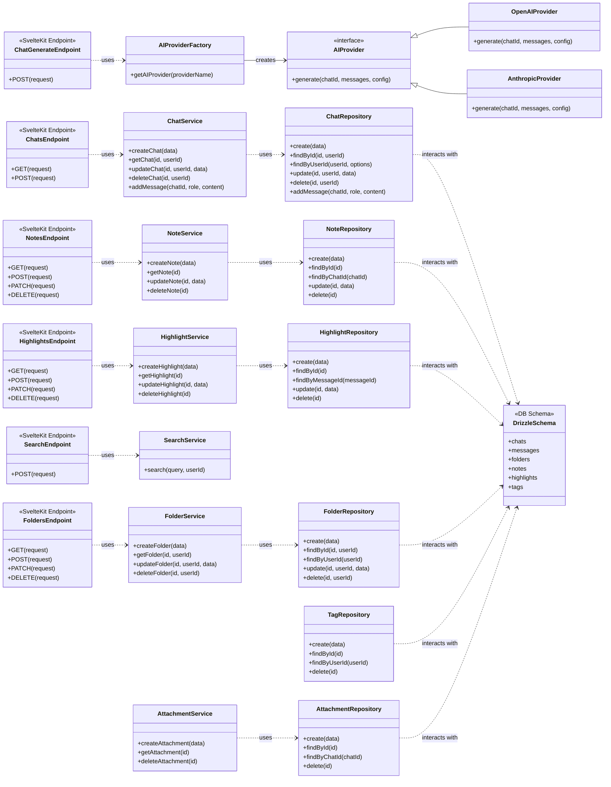

```mermaid
classDiagram
    direction LR
    %% ============================================
    %% SVELTEKIT ENDPOINTS (API Layer)
    %% ============================================
    class ChatGenerateEndpoint {
        <<SvelteKit Endpoint>>
        +POST(request)
    }
    class ChatsEndpoint {
        <<SvelteKit Endpoint>>
        +GET(request)
        +POST(request)
    }
    class NotesEndpoint {
        <<SvelteKit Endpoint>>
        +GET(request)
        +POST(request)
        +PATCH(request)
        +DELETE(request)
    }
    class HighlightsEndpoint {
        <<SvelteKit Endpoint>>
        +GET(request)
        +POST(request)
        +PATCH(request)
        +DELETE(request)
    }
    class FoldersEndpoint {
        <<SvelteKit Endpoint>>
        +GET(request)
        +POST(request)
        +PATCH(request)
        +DELETE(request)
    }
    class SearchEndpoint {
        <<SvelteKit Endpoint>>
        +POST(request)
    }

    %% ============================================
    %% SERVICE LAYER (Business Logic)
    %% ============================================
    class ChatService {
        +createChat(data)
        +getChat(id, userId)
        +updateChat(id, userId, data)
        +deleteChat(id, userId)
        +addMessage(chatId, role, content)
    }
    class NoteService {
        +createNote(data)
        +getNote(id)
        +updateNote(id, data)
        +deleteNote(id)
    }
    class HighlightService {
        +createHighlight(data)
        +getHighlight(id)
        +updateHighlight(id, data)
        +deleteHighlight(id)
    }
    class FolderService {
        +createFolder(data)
        +getFolder(id, userId)
        +updateFolder(id, userId, data)
        +deleteFolder(id, userId)
    }
    class SearchService {
        +search(query, userId)
    }
    class AttachmentService {
        +createAttachment(data)
        +getAttachment(id)
        +deleteAttachment(id)
    }

    %% ============================================
    %% REPOSITORY LAYER (Data Access)
    %% ============================================
    class ChatRepository {
        +create(data)
        +findById(id, userId)
        +findByUserId(userId, options)
        +update(id, userId, data)
        +delete(id, userId)
        +addMessage(chatId, role, content)
    }
    class NoteRepository {
        +create(data)
        +findById(id)
        +findByChatId(chatId)
        +update(id, data)
        +delete(id)
    }
    class HighlightRepository {
        +create(data)
        +findById(id)
        +findByMessageId(messageId)
        +update(id, data)
        +delete(id)
    }
    class FolderRepository {
        +create(data)
        +findById(id, userId)
        +findByUserId(userId)
        +update(id, userId, data)
        +delete(id, userId)
    }
    class TagRepository {
        +create(data)
        +findById(id)
        +findByUserId(userId)
        +delete(id)
    }
    class AttachmentRepository {
        +create(data)
        +findById(id)
        +findByChatId(chatId)
        +delete(id)
    }

    %% ============================================
    %% AI PROVIDER ABSTRACTION
    %% ============================================
    class AIProvider {
        <<interface>>
        +generate(chatId, messages, config)
    }
    class OpenAIProvider {
        +generate(chatId, messages, config)
    }
    class AnthropicProvider {
        +generate(chatId, messages, config)
    }
    class AIProviderFactory {
        +getAIProvider(providerName)
    }

    %% ============================================
    %% DATABASE
    %% ============================================
    class DrizzleSchema {
        <<DB Schema>>
        +chats
        +messages
        +folders
        +notes
        +highlights
        +tags
    }

    %% ============================================
    %% RELATIONSHIPS
    %% ============================================
    ChatsEndpoint ..> ChatService : uses
    NotesEndpoint ..> NoteService : uses
    HighlightsEndpoint ..> HighlightService : uses
    FoldersEndpoint ..> FolderService : uses
    SearchEndpoint ..> SearchService : uses
    ChatGenerateEndpoint ..> AIProviderFactory : uses
    
    ChatService ..> ChatRepository : uses
    NoteService ..> NoteRepository : uses
    HighlightService ..> HighlightRepository : uses
    FolderService ..> FolderRepository : uses
    AttachmentService ..> AttachmentRepository : uses
    
    ChatRepository ..> DrizzleSchema : interacts with
    NoteRepository ..> DrizzleSchema : interacts with
    HighlightRepository ..> DrizzleSchema : interacts with
    FolderRepository ..> DrizzleSchema : interacts with
    TagRepository ..> DrizzleSchema : interacts with
    AttachmentRepository ..> DrizzleSchema : interacts with
    
    AIProviderFactory --> AIProvider : creates
    AIProvider <|-- OpenAIProvider
    AIProvider <|-- AnthropicProvider
```