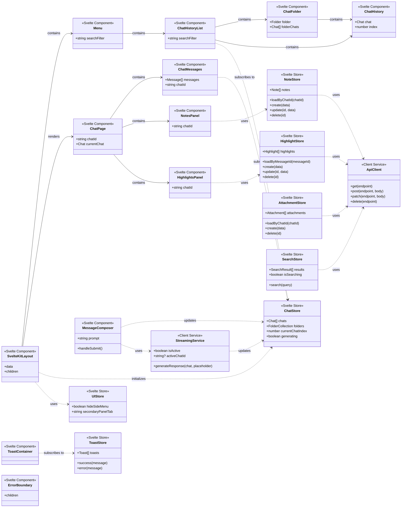

```mermaid
classDiagram
    direction LR
    %% ============================================
    %% SVELTEKIT PAGES & LAYOUTS (UI Entry Points)
    %% ============================================
    class SvelteKitLayout {
        <<Svelte Component>>
        +data
        +children
    }
    class ChatPage {
        <<Svelte Component>>
        +string chatId
        +Chat currentChat
    }

    %% ============================================
    %% UI COMPONENTS
    %% ============================================
    class Menu {
        <<Svelte Component>>
        +string searchFilter
    }
    class ChatHistoryList {
        <<Svelte Component>>
        +string searchFilter
    }
    class ChatFolder {
        <<Svelte Component>>
        +Folder folder
        +Chat[] folderChats
    }
    class ChatHistory {
        <<Svelte Component>>
        +Chat chat
        +number index
    }
    class ChatMessages {
        <<Svelte Component>>
        +Message[] messages
        +string chatId
    }
    class MessageComposer {
        <<Svelte Component>>
        +string prompt
        +handleSubmit()
    }
    class NotesPanel {
        <<Svelte Component>>
        +string chatId
    }
    class HighlightsPanel {
        <<Svelte Component>>
        +string chatId
    }
    class ToastContainer {
        <<Svelte Component>>
    }
    class ErrorBoundary {
        <<Svelte Component>>
        +children
    }

    %% ============================================
    %% SVELTE STORES (Client-Side State)
    %% ============================================
    class ChatStore {
        <<Svelte Store>>
        +Chat[] chats
        +FolderCollection folders
        +number currentChatIndex
        +boolean generating
    }
    class NoteStore {
        <<Svelte Store>>
        +Note[] notes
        +loadByChatId(chatId)
        +create(data)
        +update(id, data)
        +delete(id)
    }
    class HighlightStore {
        <<Svelte Store>>
        +Highlight[] highlights
        +loadByMessageId(messageId)
        +create(data)
        +update(id, data)
        +delete(id)
    }
    class AttachmentStore {
        <<Svelte Store>>
        +Attachment[] attachments
        +loadByChatId(chatId)
        +create(data)
        +delete(id)
    }
    class SearchStore {
        <<Svelte Store>>
        +SearchResult[] results
        +boolean isSearching
        +search(query)
    }
    class ToastStore {
        <<Svelte Store>>
        +Toast[] toasts
        +success(message)
        +error(message)
    }
    class UIStore {
        <<Svelte Store>>
        +boolean hideSideMenu
        +string secondaryPanelTab
    }

    %% ============================================
    %% CLIENT-SIDE SERVICES
    %% ============================================
    class StreamingService {
        <<Client Service>>
        +boolean isActive
        +string? activeChatId
        +generateResponse(chat, placeholder)
    }
    class ApiClient {
        <<Client Service>>
        +get(endpoint)
        +post(endpoint, body)
        +patch(endpoint, body)
        +delete(endpoint)
    }

    %% ============================================
    %% RELATIONSHIPS
    %% ============================================
    SvelteKitLayout --> Menu : contains
    SvelteKitLayout --> ChatPage : renders
    
    Menu --> ChatHistoryList : contains
    ChatHistoryList --> ChatFolder : contains
    ChatHistoryList --> ChatHistory : contains
    ChatFolder --> ChatHistory : contains
    
    ChatPage --> ChatMessages : contains
    ChatPage --> NotesPanel : contains
    ChatPage --> HighlightsPanel : contains
    
    SvelteKitLayout ..> ChatStore : initializes
    SvelteKitLayout ..> UIStore : uses
    
    ChatHistoryList ..> ChatStore : subscribes to
    ChatMessages ..> ChatStore : subscribes to
    MessageComposer ..> ChatStore : updates
    
    NotesPanel ..> NoteStore : uses
    HighlightsPanel ..> HighlightStore : uses
    
    ToastContainer ..> ToastStore : subscribes to
    
    MessageComposer ..> StreamingService : uses
    StreamingService ..> ChatStore : updates
    
    NoteStore ..> ApiClient : uses
    HighlightStore ..> ApiClient : uses
    AttachmentStore ..> ApiClient : uses
    SearchStore ..> ApiClient : uses
```