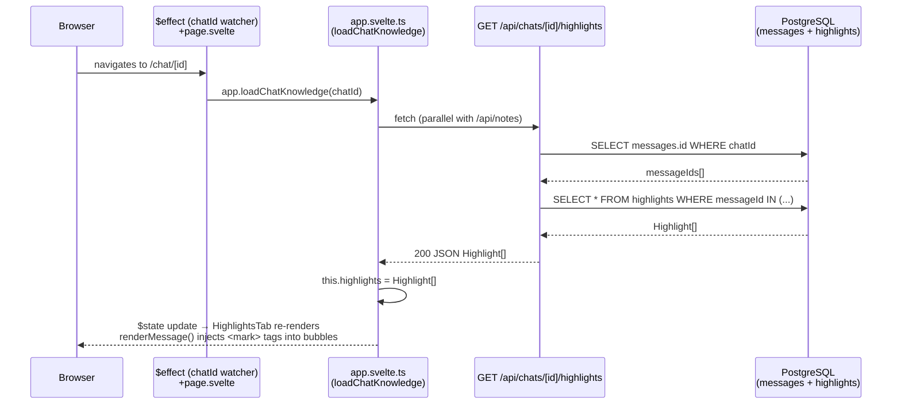
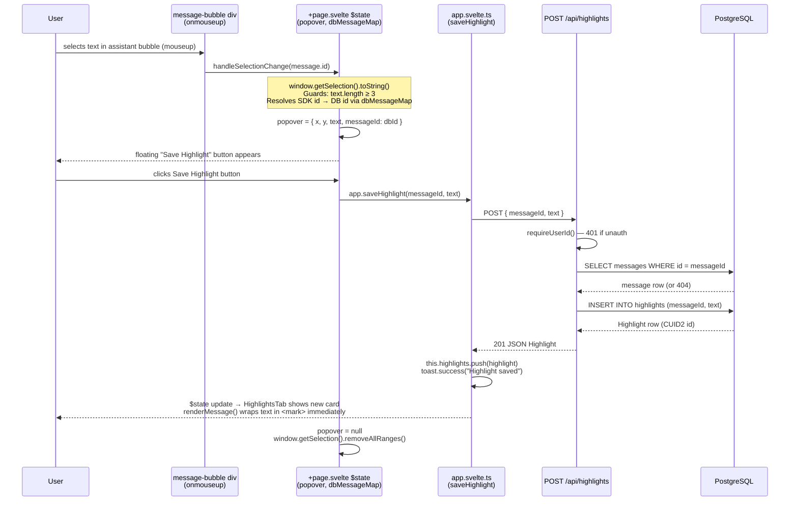
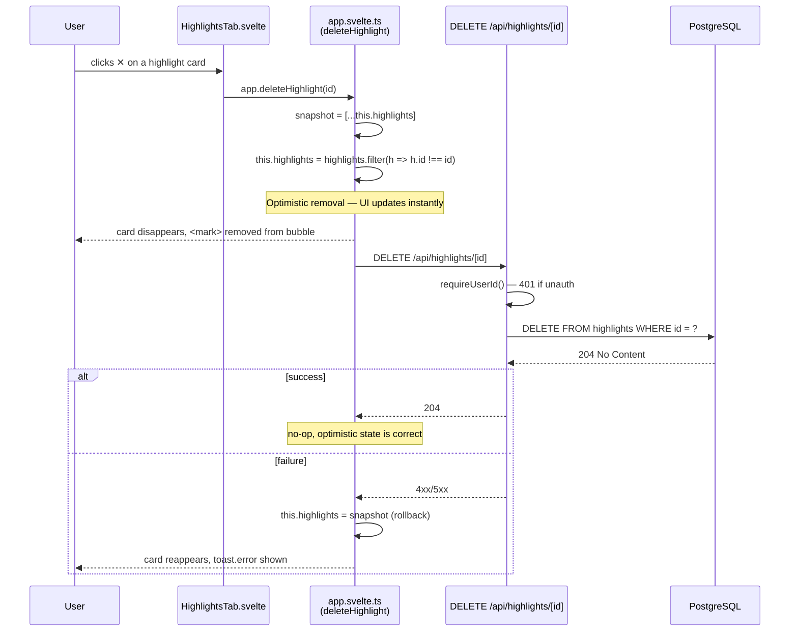

# Feature Flows — Sequence Diagrams

## Highlight Feature

Three sub-flows: **Load**, **Save**, and **Delete**.

---

### 1. Load highlights on chat navigation

Triggered by the `$effect` in `+page.svelte` that watches `chatId`.

---

### 2. Save a highlight (text selection → popover → confirm)

---

### 3. Delete a highlight (optimistic)

---

### Key implementation details

| Concern | Detail |
|---|---|
| SDK id → DB id | `dbMessageMap: Map<sdkId, dbId>` is built after streaming ends by aligning SDK messages with DB rows by index + role. `handleSelectionChange` resolves the DB id before building the `popover` object. |
| `<mark>` injection | `renderMessage()` first runs `marked.parse()` then does a global regex replace over the rendered HTML for each saved highlight text. Order matters: Markdown is rendered first, highlights overlaid second. |
| No note field in UI | The `highlights` DB table has an optional `note` column; the current UI sends only `{ messageId, text }` — `note` defaults to `null`. |
| Cascade delete | `highlights.messageId` has `onDelete: 'cascade'` — deleting a message automatically removes its highlights. |
| Auth join via messages | `GET /api/chats/[id]/highlights` has no direct `userId` column on highlights. Auth is enforced by fetching only message IDs that belong to the given chat, implicitly scoped by the chat ownership check upstream. |
