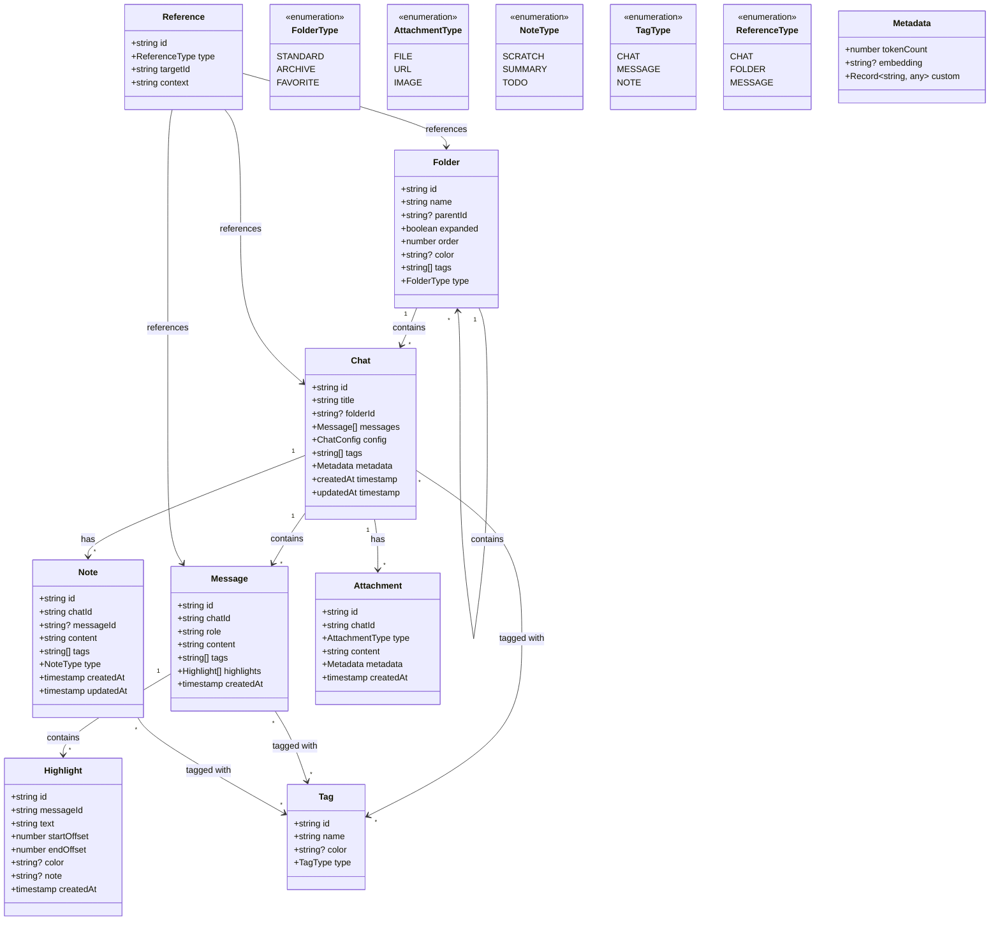
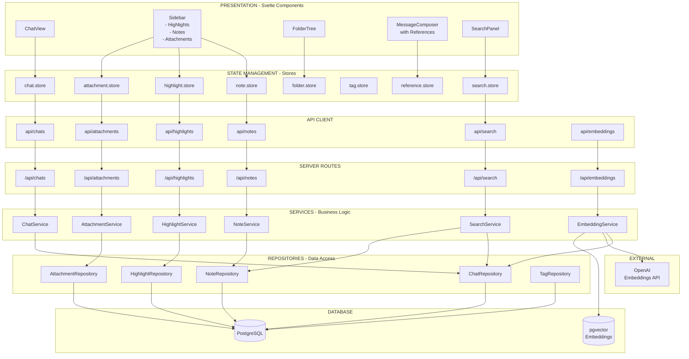

🏗️ Architecture Layers



🗄️ Database Schema
```
// src/lib/server/db/schema.ts

import { pgTable, serial, text, timestamp, varchar, jsonb, integer, boolean, vector, index, pgEnum } from 'drizzle-orm/pg-core';
import { relations } from 'drizzle-orm';

// ============================================
// ENUMS
// ============================================
export const folderTypeEnum = pgEnum('folder_type', ['STANDARD', 'ARCHIVE', 'FAVORITE']);
export const attachmentTypeEnum = pgEnum('attachment_type', ['FILE', 'URL', 'IMAGE']);
export const noteTypeEnum = pgEnum('note_type', ['SCRATCH', 'SUMMARY', 'TODO']);
export const tagTypeEnum = pgEnum('tag_type', ['CHAT', 'MESSAGE', 'NOTE']);

// ============================================
// CORE TABLES
// ============================================

export const users = pgTable('users', {
  id: serial('id').primaryKey(),
  email: varchar('email', { length: 255 }).unique(),
  createdAt: timestamp('created_at').defaultNow().notNull()
});

export const folders = pgTable('folders', {
  id: varchar('id', { length: 32 }).primaryKey(),
  userId: integer('user_id').references(() => users.id).notNull(),
  name: varchar('name', { length: 100 }).notNull(),
  parentId: varchar('parent_id', { length: 32 }).references(() => folders.id),
  type: folderTypeEnum('type').default('STANDARD').notNull(),
  expanded: boolean('expanded').default(true),
  order: integer('order').default(0),
  color: varchar('color', { length: 7 }),
  createdAt: timestamp('created_at').defaultNow().notNull(),
  updatedAt: timestamp('updated_at').defaultNow().notNull()
}, (table) => ({
  userIdIdx: index('folders_user_id_idx').on(table.userId),
  parentIdIdx: index('folders_parent_id_idx').on(table.parentId)
}));

export const chats = pgTable('chats', {
  id: varchar('id', { length: 32 }).primaryKey(),
  userId: integer('user_id').references(() => users.id).notNull(),
  folderId: varchar('folder_id', { length: 32 }).references(() => folders.id),
  title: varchar('title', { length: 100 }).notNull(),
  config: jsonb('config').notNull(),
  metadata: jsonb('metadata').$type<{ tokenCount?: number; embedding?: string }>(),
  embedding: vector('embedding', { dimensions: 1536 }), // OpenAI embedding size
  createdAt: timestamp('created_at').defaultNow().notNull(),
  updatedAt: timestamp('updated_at').defaultNow().notNull()
}, (table) => ({
  userIdIdx: index('chats_user_id_idx').on(table.userId),
  folderIdIdx: index('chats_folder_id_idx').on(table.folderId),
  embeddingIdx: index('chats_embedding_idx').using('hnsw', table.embedding.op('vector_cosine_ops'))
}));

export const messages = pgTable('messages', {
  id: serial('id').primaryKey(),
  chatId: varchar('chat_id', { length: 32 }).notNull().references(() => chats.id, { onDelete: 'cascade' }),
  role: varchar('role', { length: 16, enum: ['user', 'assistant', 'system'] }).notNull(),
  content: text('content').notNull(),
  embedding: vector('embedding', { dimensions: 1536 }),
  createdAt: timestamp('created_at').defaultNow().notNull()
}, (table) => ({
  chatIdIdx: index('messages_chat_id_idx').on(table.chatId),
  embeddingIdx: index('messages_embedding_idx').using('hnsw', table.embedding.op('vector_cosine_ops'))
}));

// ============================================
// FEATURE TABLES
// ============================================

export const notes = pgTable('notes', {
  id: varchar('id', { length: 32 }).primaryKey(),
  chatId: varchar('chat_id', { length: 32 }).notNull().references(() => chats.id, { onDelete: 'cascade' }),
  messageId: integer('message_id').references(() => messages.id, { onDelete: 'cascade' }),
  type: noteTypeEnum('type').default('SCRATCH').notNull(),
  content: text('content').notNull(),
  createdAt: timestamp('created_at').defaultNow().notNull(),
  updatedAt: timestamp('updated_at').defaultNow().notNull()
}, (table) => ({
  chatIdIdx: index('notes_chat_id_idx').on(table.chatId)
}));

export const highlights = pgTable('highlights', {
  id: varchar('id', { length: 32 }).primaryKey(),
  messageId: integer('message_id').notNull().references(() => messages.id, { onDelete: 'cascade' }),
  text: text('text').notNull(),
  startOffset: integer('start_offset').notNull(),
  endOffset: integer('end_offset').notNull(),
  color: varchar('color', { length: 7 }).default('#FFFF00'),
  note: text('note'),
  createdAt: timestamp('created_at').defaultNow().notNull()
}, (table) => ({
  messageIdIdx: index('highlights_message_id_idx').on(table.messageId)
}));

export const attachments = pgTable('attachments', {
  id: varchar('id', { length: 32 }).primaryKey(),
  chatId: varchar('chat_id', { length: 32 }).notNull().references(() => chats.id, { onDelete: 'cascade' }),
  type: attachmentTypeEnum('type').notNull(),
  content: text('content').notNull(), // URL or file path
  metadata: jsonb('metadata').$type<{ filename?: string; size?: number; mimeType?: string }>(),
  createdAt: timestamp('created_at').defaultNow().notNull()
}, (table) => ({
  chatIdIdx: index('attachments_chat_id_idx').on(table.chatId)
}));

export const tags = pgTable('tags', {
  id: serial('id').primaryKey(),
  userId: integer('user_id').references(() => users.id).notNull(),
  name: varchar('name', { length: 50 }).notNull(),
  color: varchar('color', { length: 7 }),
  type: tagTypeEnum('type').notNull(),
  createdAt: timestamp('created_at').defaultNow().notNull()
}, (table) => ({
  userIdIdx: index('tags_user_id_idx').on(table.userId),
  nameIdx: index('tags_name_idx').on(table.name)
}));

// ============================================
// JUNCTION TABLES (Many-to-Many)
// ============================================

export const chatTags = pgTable('chat_tags', {
  chatId: varchar('chat_id', { length: 32 }).notNull().references(() => chats.id, { onDelete: 'cascade' }),
  tagId: integer('tag_id').notNull().references(() => tags.id, { onDelete: 'cascade' }),
  createdAt: timestamp('created_at').defaultNow().notNull()
}, (table) => ({
  chatIdIdx: index('chat_tags_chat_id_idx').on(table.chatId),
  tagIdIdx: index('chat_tags_tag_id_idx').on(table.tagId)
}));

export const messageTags = pgTable('message_tags', {
  messageId: integer('message_id').notNull().references(() => messages.id, { onDelete: 'cascade' }),
  tagId: integer('tag_id').notNull().references(() => tags.id, { onDelete: 'cascade' }),
  createdAt: timestamp('created_at').defaultNow().notNull()
}, (table) => ({
  messageIdIdx: index('message_tags_message_id_idx').on(table.messageId),
  tagIdIdx: index('message_tags_tag_id_idx').on(table.tagId)
}));

export const noteTags = pgTable('note_tags', {
  noteId: varchar('note_id', { length: 32 }).notNull().references(() => notes.id, { onDelete: 'cascade' }),
  tagId: integer('tag_id').notNull().references(() => tags.id, { onDelete: 'cascade' }),
  createdAt: timestamp('created_at').defaultNow().notNull()
}, (table) => ({
  noteIdIdx: index('note_tags_note_id_idx').on(table.noteId),
  tagIdIdx: index('note_tags_tag_id_idx').on(table.tagId)
}));

// ============================================
// RELATIONS
// ============================================

export const foldersRelations = relations(folders, ({ one, many }) => ({
  user: one(users, { fields: [folders.userId], references: [users.id] }),
  parent: one(folders, { fields: [folders.parentId], references: [folders.id], relationName: 'folderHierarchy' }),
  children: many(folders, { relationName: 'folderHierarchy' }),
  chats: many(chats)
}));

export const chatsRelations = relations(chats, ({ one, many }) => ({
  user: one(users, { fields: [chats.userId], references: [users.id] }),
  folder: one(folders, { fields: [chats.folderId], references: [folders.id] }),
  messages: many(messages),
  notes: many(notes),
  attachments: many(attachments),
  chatTags: many(chatTags)
}));

export const messagesRelations = relations(messages, ({ one, many }) => ({
  chat: one(chats, { fields: [messages.chatId], references: [chats.id] }),
  highlights: many(highlights),
  messageTags: many(messageTags)
}));

export const notesRelations = relations(notes, ({ one, many }) => ({
  chat: one(chats, { fields: [notes.chatId], references: [chats.id] }),
  message: one(messages, { fields: [notes.messageId], references: [messages.id] }),
  noteTags: many(noteTags)
}));

export const highlightsRelations = relations(highlights, ({ one }) => ({
  message: one(messages, { fields: [highlights.messageId], references: [messages.id] })
}));

export const attachmentsRelations = relations(attachments, ({ one }) => ({
  chat: one(chats, { fields: [attachments.chatId], references: [chats.id] })
}));

export const tagsRelations = relations(tags, ({ one, many }) => ({
  user: one(users, { fields: [tags.userId], references: [users.id] }),
  chatTags: many(chatTags),
  messageTags: many(messageTags),
  noteTags: many(noteTags)
}));
```

~~📁 Updated File Structure
```
src/
├── lib/
│   ├── components/
│   │   ├── layout/
│   │   │   ├── Header.svelte
│   │   │   ├── Main.svelte
│   │   │   ├── Sidebar.svelte ✨ ENHANCED
│   │   │   ├── MessageComposer.svelte ✨ ENHANCED (with references)
│   │   │   └── SecondaryPanel.svelte ✨ NEW (highlights, notes, attachments)
│   │   ├── menu/
│   │   │   ├── Menu.svelte
│   │   │   ├── FolderTree.svelte ✨ ENHANCED (nested folders)
│   │   │   ├── ChatHistory.svelte
│   │   │   └── SearchPanel.svelte ✨ NEW
│   │   ├── chat/
│   │   │   ├── ChatView.svelte
│   │   │   ├── MessageItem.svelte ✨ ENHANCED (highlights, tags)
│   │   │   └── ReferenceChip.svelte ✨ NEW
│   │   ├── sidebar/
│   │   │   ├── HighlightsList.svelte ✨ NEW
│   │   │   ├── NotesList.svelte ✨ NEW
│   │   │   ├── AttachmentsList.svelte ✨ NEW
│   │   │   └── TagManager.svelte ✨ NEW
│   │   └── ui/
│   │       ├── Toast.svelte
│   │       └── ErrorBoundary.svelte
│   ├── stores/
│   │   ├── chat.store.ts
│   │   ├── folder.store.ts
│   │   ├── note.store.ts ✨ NEW
│   │   ├── highlight.store.ts ✨ NEW
│   │   ├── attachment.store.ts ✨ NEW
│   │   ├── tag.store.ts ✨ NEW
│   │   ├── reference.store.ts ✨ NEW
│   │   ├── search.store.ts ✨ NEW
│   │   ├── toast.store.ts
│   │   └── ui.store.ts ✨ ENHANCED (sidebar tabs)
│   ├── services/
│   │   ├── chat.service.ts ✨ ENHANCED
│   │   ├── note.service.ts ✨ NEW
│   │   ├── highlight.service.ts ✨ NEW
│   │   ├── attachment.service.ts ✨ NEW
│   │   ├── search.service.ts ✨ NEW
│   │   ├── embedding.service.ts ✨ NEW
│   │   └── streaming.service.ts
│   ├── server/
│   │   ├── db/
│   │   │   ├── schema.ts ✨ ENHANCED
│   │   │   └── index.ts
│   │   ├── repositories/
│   │   │   ├── chat.repository.ts ✨ NEW
│   │   │   ├── note.repository.ts ✨ NEW
│   │   │   ├── highlight.repository.ts ✨ NEW
│   │   │   ├── attachment.repository.ts ✨ NEW
│   │   │   └── tag.repository.ts ✨ NEW
│   │   ├── services/
│   │   │   ├── chat.service.ts ✨ NEW
│   │   │   ├── search.service.ts ✨ NEW
│   │   │   └── embedding.service.ts ✨ NEW
│   │   └── ai/
│   │       └── providers/
│   │           ├── index.ts
│   │           ├── anthropic.ts
│   │           └── openai.ts
│   ├── types/
│   │   ├── chat.ts ✨ ENHANCED
│   │   ├── note.ts ✨ NEW
│   │   ├── highlight.ts ✨ NEW
│   │   ├── attachment.ts ✨ NEW
│   │   ├── tag.ts ✨ NEW
│   │   └── search.ts ✨ NEW
│   └── utils/
│       ├── error-handler.ts
│       └── text-selection.ts ✨ NEW (highlight logic)
└── routes/
    ├── api/
    │   ├── chats/
    │   │   └── generate/+server.ts
    │   ├── notes/+server.ts ✨ NEW
    │   ├── highlights/+server.ts ✨ NEW
    │   ├── attachments/+server.ts ✨ NEW
    │   ├── tags/+server.ts ✨ NEW
    │   ├── search/+server.ts ✨ NEW
    │   └── embeddings/+server.ts ✨ NEW
    ├── chat/
    │   └── [id]/+page.svelte
    ├── +layout.svelte
    └── +layout.server.ts ✨ ENHANCED
```

🎨 UI Layout Design
```
┌─────────────────────────────────────────────────────────────────┐
│                          HEADER                                  │
│  [☰] ChatGPT Clone      [Search...]        [@username] [⚙️]     │
├──────────┬─────────────────────────────────┬────────────────────┤
│          │                                 │                    │
│ SIDEBAR  │        MAIN CHAT AREA           │  SECONDARY PANEL   │
│          │                                 │                    │
│ [+] New  │  ┌──────────────────────────┐  │  [Highlights] [Notes] [Files]   │
│          │  │ User: Hello              │  │  ┌──────────────┐ │
│ 📁 Work  │  │ AI: Hi! How can I help?  │  │  │ 📌 Highlight│ │
│  └ Chat1 │  │ User: Explain...         │  │  │ "important  │ │
│  └ Chat2 │  │ AI: Sure! [highlighted]  │  │  │ concept..." │ │
│          │  └──────────────────────────┘  │  └──────────────┘ │
│ 📁 Personal│                               │  ┌──────────────┐ │
│  └ Chat3 │  ┌──────────────────────────┐  │  │ 📝 Note     │ │
│          │  │ [📎 chat1] [📁 Work]     │  │  │ "Remember   │ │
│ 🔍 Search│  │ Type message...          │  │  │ to check..."│ │
│  #ai     │  └──────────────────────────┘  │  └──────────────┘ │
│  #work   │                                 │                    │
└──────────┴─────────────────────────────────┴────────────────────┘
```


1. Enhanced Types (src/lib/types/chat.ts)
```
typescript// src/lib/types/chat.ts

export interface Chat {
  id: string;
  title: string;
  folderId?: string;
  messages: Message[];
  config: ChatConfig;
  tags: Tag[];
  metadata: ChatMetadata;
  createdAt: Date;
  updatedAt: Date;
}

export interface Message {
  id: string;
  chatId: string;
  role: 'user' | 'assistant' | 'system';
  content: string;
  tags: Tag[];
  highlights: Highlight[];
  createdAt: Date;
}

export interface Note {
  id: string;
  chatId: string;
  messageId?: string;
  type: 'SCRATCH' | 'SUMMARY' | 'TODO';
  content: string;
  tags: Tag[];
  createdAt: Date;
  updatedAt: Date;
}

export interface Highlight {
  id: string;
  messageId: string;
  text: string;
  startOffset: number;
  endOffset: number;
  color?: string;
  note?: string;
  createdAt: Date;
}

export interface Attachment {
  id: string;
  chatId: string;
  type: 'FILE' | 'URL' | 'IMAGE';
  content: string; // URL or file path
  metadata: {
    filename?: string;
    size?: number;
    mimeType?: string;
  };
  createdAt: Date;
}

export interface Tag {
  id: string;
  name: string;
  color?: string;
  type: 'CHAT' | 'MESSAGE' | 'NOTE';
}

export interface Reference {
  id: string;
  type: 'CHAT' | 'FOLDER' | 'MESSAGE';
  targetId: string;
  title: string; // Display name
}

export interface ChatMetadata {
  tokenCount?: number;
  embedding?: number[]; // Vector embedding
}

export interface SearchQuery {
  text?: string;
  tags?: string[];
  semantic?: boolean;
  folderId?: string;
  dateFrom?: Date;
  dateTo?: Date;
}

export interface SearchResult {
  chatId: string;
  messageId?: string;
  title: string;
  snippet: string;
  score: number;
  highlights: string[];
}
```

🚀 Implementation Phases


✅ Update database schema (add tables for notes, highlights, attachments, tags)
✅ Create repository layer
✅ Update types

Phase 2: Notes & Highlights
✅ Implement note CRUD operations
✅ Implement text selection → highlight creation
✅ Build SecondaryPanel component
✅ Add highlights/notes API endpoints

Phase 3: Attachments & Tags 

✅ Implement file upload
✅ Implement URL attachment
✅ Tag management system
✅ Tag filtering UI

Phase 4: Search 

✅ Full-text search implementation
✅ Semantic search with embeddings
✅ Search UI with filters

Phase 5: References 

✅ Reference picker UI (@ mentions style)
✅ Context building from references
✅ Display referenced content in chat


✅ Constraints

No Over-Engineering: Simple repository pattern, no complex DDD
Gradual Enhancement: Build features incrementally
Leverage Existing Tools: Use pgvector for embeddings, no custom ML
DaisyUI Components: Use existing UI library
Svelte Stores: Keep state management simple