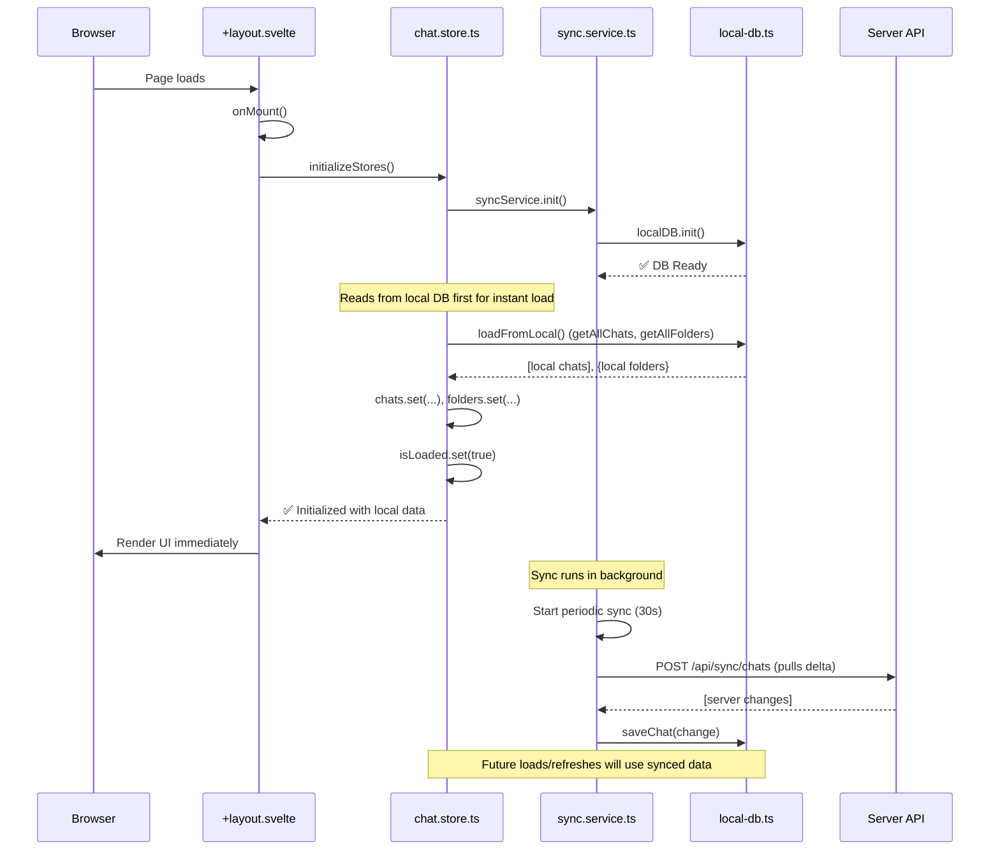
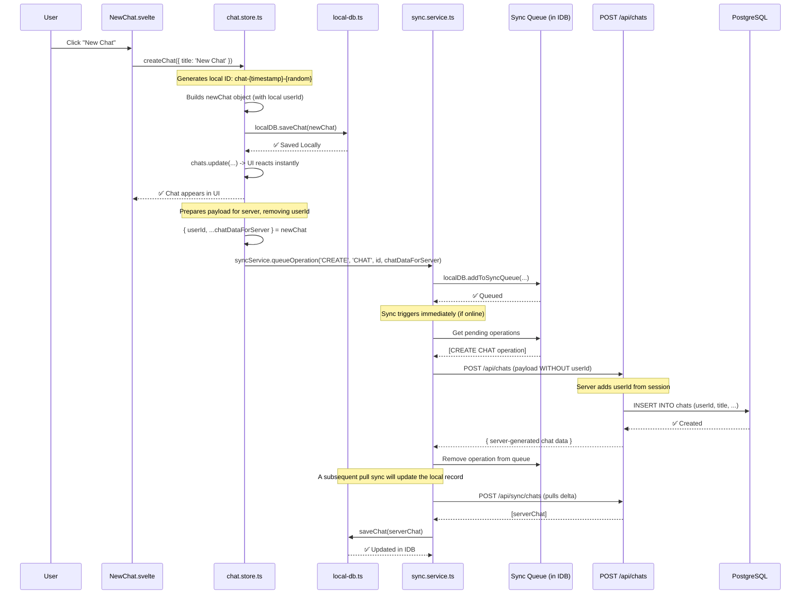
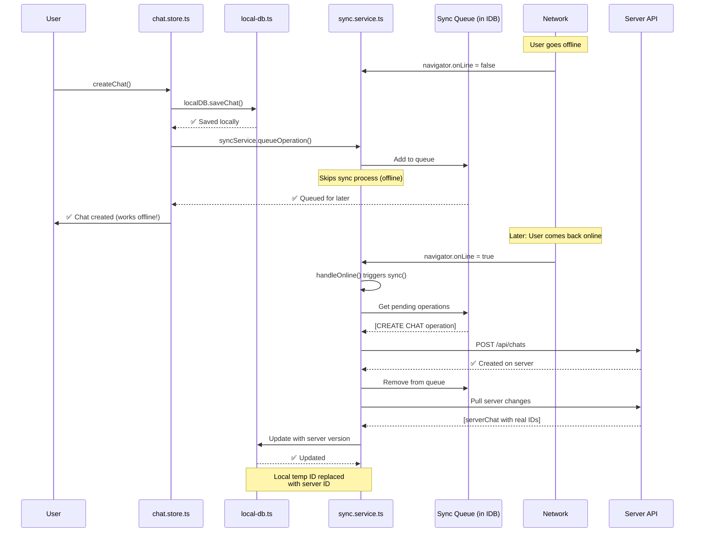
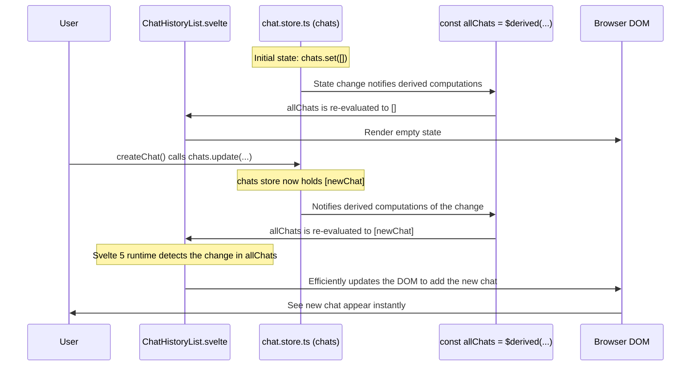
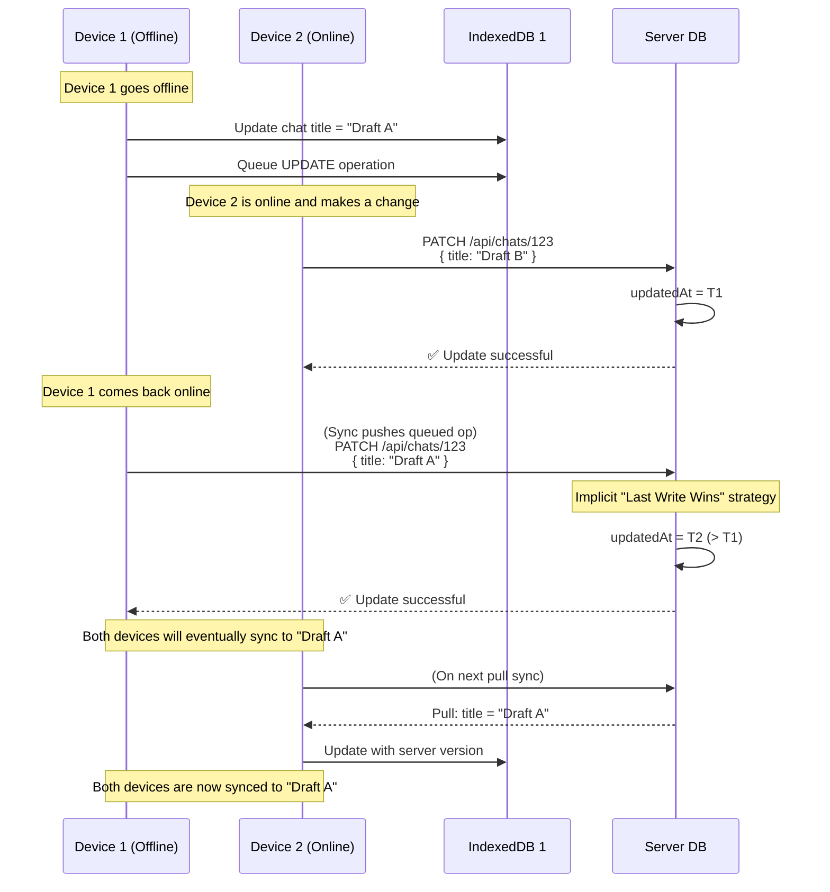

## Diagram 1: App Initialization Flow

## Diagram 2: Create Chat Flow (Local-First with Sync)

## Diagram 3: Offline Chat Creation (Queue & Retry)

## Diagram 4: Data Binding & Reactivity Flow

## Diagram 5: Sync Conflict Resolution (Future State)
