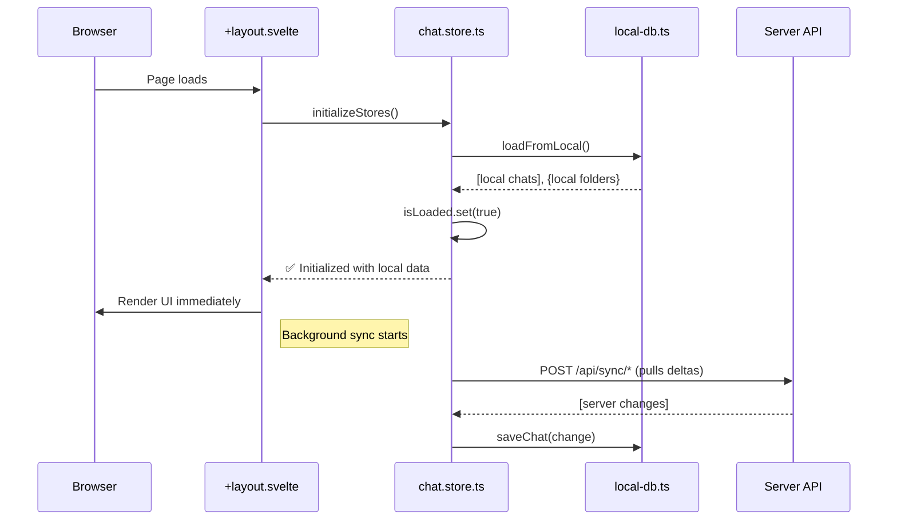
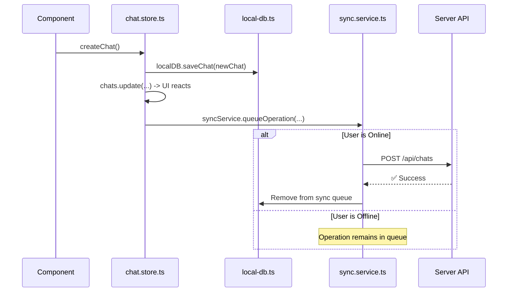

Of course. As a precise TypeScript engineer, here is the concise documentation for your `documentation.md` file, adhering to your structure and referencing the codebase to avoid duplication.

---

## 1. Domain Understanding

### Domain Glossary

| Term | Definition | Reference |
| :--- | :--- | :--- |
| **Chat** | The primary entity representing a single conversation thread with an AI model. Contains messages, configuration, and metadata. | `src/lib/types/chat.ts` |
| **Folder** | A container for organizing chats. Folders can be nested and have properties like color and type (Standard, Archive). | `src/lib/types/chat.ts` |
| **Message** | A single turn in a conversation, belonging to either a `user` or an `assistant`. | `src/lib/types/chat.ts` |
| **Note** | User-created annotations attached to a chat or a specific message. Can be of type `SCRATCH`, `SUMMARY`, or `TODO`. | `src/lib/types/note.ts` |
| **Highlight** | A user-selected text snippet within a message, saved for future reference. Can have an associated color and note. | `src/lib/types/highlight.ts` |
| **Local-First** | An architectural principle where the client-side database (IndexedDB) is the primary source of truth for the UI, enabling offline functionality and optimistic updates. | `src/lib/stores/chat.store.ts` |
| **Sync Queue** | A queue stored in IndexedDB that holds pending create, update, and delete operations to be pushed to the server when online. | `src/lib/services/local-db.ts` |

### Business Rules and Constraints

*   A user must exist to create any domain entity (Chat, Folder, etc.). The default `userId` is `1` for development.
*   Folders can be nested, but the business logic enforces a maximum depth of 5 levels to prevent infinite recursion. See `folder.service.ts`.
*   A non-empty folder cannot be deleted without a `cascade=true` flag, which moves its chats to the root. See `api/folders/[id]/+server.ts`.
*   Highlights must correspond to a valid text range within their associated message. This is validated on the server. See `highlight.repository.ts`.

### Domain Model

The core entities are `User`, `Chat`, `Folder`, `Message`, `Note`, and `Highlight`. Their relationships are defined by foreign keys in the database schema.

*   A `User` has many `Chats` and `Folders`.
*   A `Folder` can contain many `Chats`.
*   A `Chat` contains many `Messages`.
*   `Notes` and `Highlights` are associated with `Chats` and/or `Messages`.

For a detailed relational model, refer to the Drizzle ORM schema definitions.
**Reference:** `src/lib/server/db/schema.ts`

### Core Business Processes

1.  **Chat Creation & Interaction:** A user initiates a chat, which is saved locally first. They send messages, and the AI streams a response. The entire conversation is persisted locally and synced to the server in the background.
2.  **Data Organization:** Users can create folders and drag-and-drop chats into them to organize their conversations.
3.  **Annotation:** Users can select text within messages to create `Highlights` or add `Notes` to a chat for summarization or to-do tracking.

## 2. Architecture Overview

### System Architecture Diagram

The application follows a layered, local-first architecture separating client and server concerns.

```mermaid
classDiagram
    direction TB
    subgraph Client
        direction LR
        ClientUI
        ClientStores
        ClientServices
    end
    subgraph Server
        direction LR
        ServerAPI
        ServerServices
        ServerRepos
        ServerData
    end

    ClientUI --> ClientStores : Subscribes to state
    ClientStores --> ClientServices : Uses for local persistence & sync
    ClientServices --> ServerAPI : HTTP requests (via SyncService)

    ServerAPI --> ServerServices : Delegates requests
    ServerServices --> ServerRepos : Executes business logic
    ServerRepos --> ServerData : Performs CRUD operations
```

### Component Interaction Patterns

*   **UI -> Store:** Svelte components dispatch actions by calling functions exported from the Svelte stores (e.g., `createChat()`). They do not call the API directly.
*   **Store -> Local DB -> Sync Service:** Store functions perform optimistic updates by writing directly to IndexedDB via `local-db.ts`. They then queue the operation for background synchronization using `sync.service.ts`.
*   **Server Layers:** API endpoints in `src/routes/api` receive HTTP requests, validate them, and delegate business logic to the corresponding service in `src/lib/server/services`. Services orchestrate one or more repositories (`src/lib/server/repositories`) to interact with the database.

### Data Flow Diagrams

#### Application Initialization

This diagram shows the local-first data loading strategy for a fast, responsive startup.
**Reference:** `src/routes/+layout.svelte` and `src/lib/stores/chat.store.ts`

#### Offline-First Data Creation (e.g., New Chat)

This flow enables full offline functionality. All write operations follow this pattern.
**Reference:** `src/lib/stores/chat.store.ts` and `src/lib/services/sync.service.ts`

## 3. Functional Requirements

### User Stories

*   **As a user, I want to start a new chat** so that I can get answers from the AI.
    *   *Acceptance Criteria:* Clicking "New Chat" creates a chat locally, displays it in the sidebar, and navigates to the new chat page. The operation is queued for server sync.
*   **As a user, I want my conversations to work offline** so that I can continue working without an internet connection.
    *   *Acceptance Criteria:* Creating/editing chats, notes, and folders works seamlessly offline. Changes are automatically synced when the connection is restored.
*   **As a user, I want to organize my chats into folders** so I can easily find past conversations.
    *   *Acceptance Criteria:* Users can create, rename, and delete folders. Chats can be moved into folders.
*   **As a user, I want to highlight important text in a message** so I can quickly review key information.
    *   *Acceptance Criteria:* Selecting text and choosing "Highlight" saves the selection. Highlights are visible in the message and in a dedicated side panel.

## 4. Technical Specifications

### API Contracts

The API is defined by the SvelteKit file-based router. All endpoints are located under `src/routes/api/`.

| Endpoint | Method | Description | Request/Response Types |
| :--- | :--- | :--- | :--- |
| `/api/chats` | `POST` | Creates a new chat. | `CreateChatDTO` -> `Chat` |
| `/api/chats/[id]` | `PATCH` | Updates a chat's title or folder. | `UpdateChatDTO` -> `Chat` |
| `/api/chat/generate` | `POST` | Streams an AI response for a given chat context. | `Chat` -> `ReadableStream` |
| `/api/folders` | `POST` | Creates a new folder. | `CreateFolderDTO` -> `Folder` |
| `/api/notes` | `POST` | Creates a new note. | `CreateNoteDTO` -> `Note` |
| `/api/sync/*` | `POST` | Endpoints for delta-based synchronization. | `{ lastSyncTime }` -> `{ entities }` |

**Reference:** `src/routes/api/**/*.ts` for complete request/response formats.

### Database Schema

The database schema is managed by Drizzle ORM and defined programmatically. It includes tables for `users`, `chats`, `folders`, `messages`, `notes`, `highlights`, `attachments`, and `tags`, along with their relationships.

The schema supports vector embeddings for semantic search capabilities.
**Reference:** `src/lib/server/db/schema.ts`

### Authentication and Authorization

Currently, the application operates with a hardcoded `userId = 1`. A production implementation would replace this with a proper authentication mechanism (e.g., JWTs, session cookies via SvelteKit hooks) to populate `event.locals.user`. All service and repository methods are designed to accept a `userId` to enforce data ownership.

### Error Handling

A centralized error handling strategy is implemented.

*   **`AppError`:** A custom error class for application-specific issues.
*   **`withErrorHandling`:** A utility wrapper for client-side operations that automatically catches errors, displays a user-friendly toast notification, and logs to the console.
*   **`ErrorBoundary.svelte`:** A Svelte component that acts as a catch-all for rendering errors, preventing the entire UI from crashing.

**Reference:** `src/lib/utils/error-handler.ts` and `ErrorBoundary.svelte`.

## 5. UI/UX Design

The UI is built with Svelte 5, TailwindCSS, and the Skeleton UI toolkit, providing a modern and responsive interface.

### Key Interfaces

*   **Main Layout:** A three-column layout featuring a collapsible sidebar for navigation, a central content area for the chat, and a secondary panel for notes/highlights.
*   **Chat View:** A familiar chat bubble interface with a message composer at the bottom.
*   **Sidebar:** Contains a searchable list of chats organized into expandable folders.

### Design System

The core design system is provided by Skeleton UI, customized with application-specific styles.
**Reference:** `src/app.css` for theme overrides and custom component styles.

## 6. Implementation Guidelines

### Coding Standards

*   **Language:** TypeScript is used for all logic. Svelte 5 runes (`$state`, `$derived`) are used for reactivity.
*   **Linting:** ESLint with TypeScript and Svelte plugins is configured to enforce code quality.
*   **Formatting:** Code formatting is expected to be consistent (e.g., via Prettier, not explicitly configured but implied).

**Reference:** `eslint.config.js`

### Testing Strategy

The project employs a multi-layered testing strategy.

*   **Unit Tests (Vitest):** For testing individual stores and utility functions. See `stores.spec.ts`.
*   **API Integration Tests (Playwright):** For testing API endpoints directly without a browser. See `tests/integration/api.spec.ts`.
*   **End-to-End (E2E) Tests (Playwright):** For simulating full user workflows in a browser. Page Object Models (POM) are used for maintainability. See `tests/e2e/` and `tests/page-objects/`.

**Reference:** `playwright.config.ts` and `tests/` directory.

### Deployment

The application is configured for deployment on Vercel using `@sveltejs/adapter-vercel`. The pipeline is defined by the scripts in `package.json`: `build` -> `preview`.

**Reference:** `svelte.config.js`

## 7. Project Context

### Project Goals

*   To create a highly responsive, feature-rich chat application.
*   To provide a seamless user experience with full offline capabilities.
*   To build a robust and maintainable codebase using modern SvelteKit and TypeScript.

### Known Constraints and Limitations

*   **Authentication:** Currently mocked with a static user ID. A full implementation is required.
*   **Semantic Search:** The database schema supports embeddings, but the search service implementation is a placeholder.
*   **Conflict Resolution:** The current sync model uses an implicit "Last Write Wins" strategy. More advanced conflict resolution (e.g., CRDTs) is not implemented.