```mermaid
flowchart TD
    subgraph "👨‍💻 User"
        direction LR
        Interaction["User interacts with UI (e.g., clicks 'Save Note')"]
    end

    subgraph "🖥️ Svelte Components (UI Layer)"
        direction LR
        Page["+page.svelte"]
        Panel["NotesPanel.svelte"]
    end

    subgraph "⚙️ State & Logic (Business Layer)"
        direction LR
        ChatStore["chat.store.ts (Global State)"]
        NoteManager["note.store.ts (Scoped State Manager)"]
    end

    subgraph "🔄 Sync & Persistence (Service Layer)"
        direction LR
        SyncService["sync.service.ts"]
        LocalDB["local-db.ts (IndexedDB)"]
    end

    %% Flow
    Interaction --> Panel
    Panel -- Calls method on --> NoteManager
    Page -- Reads global state from --> ChatStore

    NoteManager -- Updates its own state & calls --> LocalDB
    LocalDB -- Persists data --> IDB[("IndexedDB")]
    NoteManager -- Queues operation with --> SyncService

    SyncService -- Pushes queue to --> API[("☁️ Server API")]
    SyncService -- Stores queue in --> LocalDB

    %% Styling
    classDef ui fill:#f3e5f5,stroke:#6a1b9a
    classDef state fill:#e3f2fd,stroke:#1565c0
    classDef services fill:#e8f5e9,stroke:#2e7d32

    class Page,Panel ui
    class ChatStore,NoteManager state
    class SyncService,LocalDB services
```

## Client-Side Architecture Flow

## Server-Side Architecture Flow

```mermaid
flowchart TD
    subgraph "🌐 API Layer (routes/api)"
        ChatEndpoints["/api/chats/**/+server.ts"]
        FolderEndpoints["/api/folders/**/+server.ts"]
        GenerateEndpoint["/api/chat/generate/+server.ts"]
    end

    subgraph "⚙️ Service Layer (lib/server/services)"
        ChatService["chat.service.ts"]
        FolderService["folder.service.ts"]
        AIProvider["AI Provider Factory"]
    end

    subgraph "🗄️ Repository Layer (lib/server/repositories)"
        ChatRepo["chat.repository.ts"]
        FolderRepo["folder.repository.ts"]
    end

    subgraph "💾 Data Layer (lib/server/db)"
        Drizzle["Drizzle ORM Instance"]
        Schema["schema.ts"]
        Postgres[("PostgreSQL")]
    end

    %% Dependencies
    ChatEndpoints --> ChatService
    FolderEndpoints --> FolderService
    GenerateEndpoint --> AIProvider

    ChatService --> ChatRepo
    FolderService --> FolderRepo

    ChatRepo --> Drizzle
    FolderRepo --> Drizzle

    Drizzle -- Uses --> Schema
    Schema -- Maps to --> Postgres

    %% Critical Path Highlighting
    ChatEndpoints -.->|"Request Entry"| ChatService
    ChatService -.->|"Business Logic"| ChatRepo
    ChatRepo -.->|"Data Access"| Drizzle

    %% Styling
    classDef api fill:#e3f2fd,stroke:#1565c0
    classDef services fill:#e8f5e9,stroke:#2e7d32
    classDef repos fill:#fbe9e7,stroke:#d84315
    classDef data fill:#eceff1,stroke:#37474f
    classDef critical stroke:#d32f2f,stroke-width:2px,stroke-dasharray: 5 5

    class ChatEndpoints,FolderEndpoints,GenerateEndpoint api
    class ChatService,FolderService,AIProvider services
    class ChatRepo,FolderRepo repos
    class Drizzle,Schema,Postgres data
```

## Local-First Data Sync Flow

## AI Response streaming

## 1. Domain Understanding

### Domain Glossary

| Term | Definition | Reference |
| :--- | :--- | :--- |
| **Chat** | The primary entity representing a single conversation thread with an AI model. Contains messages, configuration, and metadata. | `src/lib/types/chat.ts` |
| **Folder** | A container for organizing chats. Folders can be nested and have properties like color and type (Standard, Archive). | `src/lib/types/chat.ts` |
| **Message** | A single turn in a conversation, belonging to either a `user` or an `assistant`. | `src/lib/types/chat.ts` |
| **Note** | User-created annotations attached to a chat or a specific message. Can be of type `SCRATCH`, `SUMMARY`, or `TODO`. | `src/lib/types/note.ts` |
| **Highlight** | A user-selected text snippet within a message, saved for future reference. Can have an associated color and note. | `src/lib/types/highlight.ts` |
| **Local-First** | An architectural principle where the client-side database (IndexedDB) is the primary source of truth for the UI, enabling offline functionality and optimistic updates. | `src/lib/stores/chat.store.ts` |
| **Sync Queue** | A queue stored in IndexedDB that holds pending create, update, and delete operations to be pushed to the server when online. | `src/lib/services/local-db.ts` |

### Business Rules and Constraints

*   A user must exist to create any domain entity (Chat, Folder, etc.). The default `userId` is `1` for development.
*   **A non-empty folder cannot be permanently deleted.** It can be soft-deleted (moved to trash), which will move its contained chats to the root level. See `api/folders/[id]/+server.ts`. **(Modified)**
*   **Soft-deleted folders are not visible in the main folder list** but can be viewed in a separate "Trash" area. **(New)**
*   **Folders in the trash can be restored** to their original state or **permanently deleted**. **(New)**
*   Highlights must correspond to a valid text range within their associated message. This is validated on the server. See `highlight.repository.ts`.

### Domain Model

The core entities are `User`, `Chat`, `Folder`, `Message`, `Note`, and `Highlight`. Their relationships are defined by foreign keys in the database schema.

*   A `User` has many `Chats` and `Folders`.
*   A `Folder` can contain many `Chats`.
*   A `Chat` contains many `Messages`.
*   `Notes` and `Highlights` are associated with `Chats` and/or `Messages`.

For a detailed relational model, refer to the Drizzle ORM schema definitions.
**Reference:** `src/lib/server/db/schema.ts`

### Core Business Processes

1.  **Chat Creation & Interaction:** A user initiates a chat, which is saved locally first. They send messages, and the AI streams a response. The entire conversation is persisted locally and synced to the server in the background.
2.  **Data Organization:** Users can create folders and drag-and-drop chats into them to organize their conversations.
3.  **Annotation:** Users can select text within messages to create `Highlights` or add `Notes` to a chat for summarization or to-do tracking.

## 2. Architecture Overview

### System Architecture Diagram

The application follows a layered, local-first architecture separating client and server concerns.

```mermaid
classDiagram
    direction TB
    subgraph Client
        direction LR
        ClientUI
        ClientStores
        ClientServices
    end
    subgraph Server
        direction LR
        ServerAPI
        ServerServices
        ServerRepos
        ServerData
    end

    ClientUI --> ClientStores : Subscribes to state
    ClientStores --> ClientServices : Uses for local persistence & sync
    ClientServices --> ServerAPI : HTTP requests (via SyncService)

    ServerAPI --> ServerServices : Delegates requests
    ServerServices --> ServerRepos : Executes business logic
    ServerRepos --> ServerData : Performs CRUD operations
```

### Component Interaction Patterns

*   **UI -> Store:** Svelte components dispatch actions by calling functions exported from the Svelte stores (e.g., `createChat()`). They do not call the API directly.
*   **Store -> Local DB -> Sync Service:** Store functions perform optimistic updates by writing directly to IndexedDB via `local-db.ts`. They then queue the operation for background synchronization using `sync.service.ts`.
*   **Server Layers:** API endpoints in `src/routes/api` receive HTTP requests, validate them, and delegate business logic to the corresponding service in `src/lib/server/services`. Services orchestrate one or more repositories (`src/lib/server/repositories`) to interact with the database.

### Data Flow Diagrams

#### Application Initialization

This diagram shows the local-first data loading strategy for a fast, responsive startup.
**Reference:** `src/routes/+layout.svelte` and `src/lib/stores/chat.store.ts`

```mermaid
sequenceDiagram
    participant Browser
    participant Layout as +layout.svelte
    participant Store as chat.store.ts
    participant IDB as local-db.ts
    participant API as Server API

    Browser->>Layout: Page loads
    Layout->>Store: initializeStores()
    Store->>IDB: loadFromLocal()
    IDB-->>Store: [local chats], {local folders}
    Store->>Store: isLoaded.set(true)
    Store-->>Layout: ✅ Initialized with local data
    Layout->>Browser: Render UI immediately
    
    Note right of Layout: Background sync starts
    Store->>API: POST /api/sync/* (pulls deltas)
    API-->>Store: [server changes]
    Store->>IDB: saveChat(change)
```

#### Offline-First Data Creation (e.g., New Chat)

This flow enables full offline functionality. All write operations follow this pattern.
**Reference:** `src/lib/stores/chat.store.ts` and `src/lib/services/sync.service.ts`

## 3. Functional Requirements

### User Stories

#### Epic 1: Core Chat Management

**US-001: Create New Chat**
- **As a user, I want to create a new chat** so that I can start a fresh conversation with the AI.
- **Acceptance Criteria:**
  - Clicking "New Chat" creates a chat locally with title "New Chat"
  - Chat appears immediately in the sidebar (optimistic UI)
  - Chat is assigned a temporary local ID (`chat-{timestamp}-{random}`)
  - Operation is queued for server sync in background
  - User is navigated to the new chat page (`/chat/{id}`)
  - **Given** I'm on any page, **When** I click "New Chat", **Then** I see an empty chat ready for input

**US-002: Send Message and Receive AI Response**
- **As a user, I want to send a message and get an AI response** so that I can have a conversation.
- **Acceptance Criteria:**
  - Typing in composer and pressing Enter/Send adds message to chat
  - My message appears immediately in the chat history
  - AI response streams in real-time (token by token)
  - Composer is disabled during AI response generation
  - Both messages are persisted locally and synced to server
  - **Given** I'm in a chat, **When** I send "Hello", **Then** I see my message and get an AI response

**US-003: View Chat History**
- **As a user, I want to see my previous chats** so that I can continue past conversations.
- **Acceptance Criteria:**
  - Sidebar shows list of all my chats with titles
  - Chats are ordered by most recent activity
  - Clicking a chat loads its full message history
  - Current chat is visually highlighted in sidebar
  - Chat titles are truncated if too long
  - **Given** I have multiple chats, **When** I click on a chat in sidebar, **Then** I see its full conversation

#### Epic 2: Chat Organization

**US-004: Rename Chat**
- **As a user, I want to rename a chat** so that I can give it a meaningful title.
- **Acceptance Criteria:**
  - Right-click or hover reveals "Rename" option
  - Clicking "Rename" makes title editable inline
  - Pressing Enter or clicking away saves the new title
  - Title updates immediately in UI (optimistic)
  - Change is queued for server sync
  - **Given** I have a chat titled "New Chat", **When** I rename it to "Project Planning", **Then** I see the new title everywhere

**US-005: Delete Chat**
- **As a user, I want to delete a chat I no longer need** so that I can keep my history clean.
- **Acceptance Criteria:**
  - Right-click or hover reveals "Delete" option
  - Clicking "Delete" shows confirmation dialog
  - Confirming removes chat from sidebar immediately
  - If viewing deleted chat, redirect to another chat or home
  - Deletion is queued for server sync
  - **Given** I have a chat I don't need, **When** I delete it and confirm, **Then** it disappears from my chat list

**US-006: Create Folder**
- **As a user, I want to create folders** so that I can organize related chats together.
- **Acceptance Criteria:**
  - "New Folder" button/option creates empty folder
  - Folder appears in sidebar with default name "New Folder"
  - Folder name is immediately editable after creation
  - Empty folders are allowed and visible
  - Folder creation is queued for server sync
  - **Given** I want to organize chats, **When** I create a new folder, **Then** I see an empty folder ready to be named

**US-007: Move Chat to Folder**
- **As a user, I want to move chats into folders** so that I can group related conversations.
- **Acceptance Criteria:**
  - Drag and drop chat onto folder moves it there
  - Alternative: Right-click → "Move to Folder" → select folder
  - Chat appears nested under the folder in sidebar
  - Folder shows count of chats it contains
  - Move operation is queued for server sync
  - **Given** I have chats and folders, **When** I drag a chat to a folder, **Then** the chat appears inside that folder

**US-007a: Move Folder to Trash (Soft Delete)** **(New/Modified)**
- **As a user, I want to move a folder to the trash** so that I can clean my sidebar without losing the data immediately.
- **Acceptance Criteria:**
  - Clicking "Delete" on a folder shows a confirmation dialog.
  - Confirming moves the folder from the main sidebar list to a "Trash" area.
  - The folder disappears immediately from the main list (optimistic UI).
  - Any chats inside the folder are moved to the root level.
  - The operation is queued for server sync.
  - **Given** I have a folder I don't need, **When** I move it to trash, **Then** it disappears from my main list and appears in the trash.

**US-007b: Restore Folder from Trash** **(New)**
- **As a user, I want to restore a folder from the trash** in case I deleted it by mistake.
- **Acceptance Criteria:**
  - The "Trash" area lists all soft-deleted folders.
  - Each deleted folder has a "Restore" option.
  - Clicking "Restore" moves the folder back to the main sidebar list.
  - The folder reappears immediately (optimistic UI).
  - The restore operation is queued for server sync.
  - **Given** a folder is in the trash, **When** I click "Restore", **Then** it is moved back to my main folder list.

**US-007c: Permanently Delete Folder** **(New)**
- **As a user, I want to permanently delete a folder from the trash** to free up space or for privacy.
- **Acceptance Criteria:**
  - Each deleted folder in the trash has a "Delete Permanently" option.
  - Clicking it shows a high-severity confirmation dialog ("This cannot be undone").
  - Confirming permanently removes the folder from the local database and the UI.
  - The permanent deletion is queued for server sync.
  - **Given** a folder is in the trash, **When** I permanently delete it, **Then** it is gone forever and cannot be restored.

#### Epic 3: Offline-First Experience

**US-008: Work Offline**
- **As a user, I want the app to work when I'm offline** so that I can continue working without internet.
- **Acceptance Criteria:**
  - All chat creation, editing, and organization works offline
  - Changes are saved locally in IndexedDB
  - UI shows no difference between online/offline for local operations
  - Operations are queued for sync when connection returns
  - **Given** I lose internet connection, **When** I create chats and folders, **Then** everything works normally

**US-009: Automatic Sync When Online**
- **As a user, I want my changes to sync automatically** so that I don't lose data or have to manually sync.
- **Acceptance Criteria:**
  - When connection is restored, queued operations sync to server
  - Sync happens in background without blocking UI
  - Conflicts are resolved (server wins for now)
  - Sync errors are logged but don't break the app
  - **Given** I made changes offline, **When** I come back online, **Then** my changes appear on other devices

#### Epic 4: Notes and Highlights

**US-010: Add Note to Chat**
- **As a user, I want to add notes to a chat** so that I can capture key insights or todos.
- **Acceptance Criteria:**
  - Notes panel shows "Add Note" button
  - Clicking opens note editor with title and content fields
  - Notes can be typed: SCRATCH, SUMMARY, or TODO
  - Saving adds note to chat's notes list
  - Notes are timestamped and persist locally
  - **Given** I'm in a chat, **When** I add a note "Key API endpoints discussed", **Then** I see it in the Notes panel

**US-011: Highlight Text in Messages**
- **As a user, I want to highlight important text** so that I can quickly find key information later.
- **Acceptance Criteria:**
  - Selecting text in a message shows "Highlight" option
  - Clicking "Highlight" marks the text with colored background
  - Highlighted text appears in Highlights panel
  - Clicking highlight in panel scrolls to and flashes the text
  - Highlights persist across sessions
  - **Given** I see important text in a message, **When** I select and highlight it, **Then** I can find it later in the Highlights panel

#### Epic 5: Search and Discovery

**US-012: Search Across All Chats**
- **As a user, I want to search my chat history** so that I can find past conversations quickly.
- **Acceptance Criteria:**
  - Search box in sidebar searches across all chat content
  - Results show matching chats with highlighted snippets
  - Clicking result opens that chat and scrolls to match
  - Search works on chat titles, message content, and notes
  - Search is fast and works offline (local IndexedDB)
  - **Given** I have many chats, **When** I search for "API authentication", **Then** I see all relevant conversations

#### Epic 6: Application Reliability

**US-013: Handle Errors Gracefully**
- **As a user, I want clear feedback when something goes wrong** so that I know what happened and what to do.
- **Acceptance Criteria:**
  - Network errors show toast: "Connection lost, working offline"
  - Server errors show toast: "Sync failed, will retry automatically"
  - Component crashes show error boundary instead of blank page
  - All errors are logged for debugging
  - App continues working despite individual failures
  - **Given** something goes wrong, **When** an error occurs, **Then** I see a helpful message and can continue using the app

**US-014: Fast App Loading**
- **As a user, I want the app to load quickly** so that I can start working immediately.
- **Acceptance Criteria:**
  - App shows chat list within 500ms of page load
  - Data loads from local IndexedDB first (instant)
  - Server sync happens in background after initial load
  - Loading states are minimal and non-blocking
  - **Given** I open the app, **When** the page loads, **Then** I see my chats immediately without waiting

## 4. Technical Specifications

### API Contracts

The API is defined by the SvelteKit file-based router. All endpoints are located under `src/routes/api/`.

| Endpoint | Method | Description | Request/Response Types |
| :--- | :--- | :--- | :--- |
| `/api/chats` | `POST` | Creates a new chat. | `CreateChatDTO` -> `Chat` |
| `/api/chats/[id]` | `PATCH` | Updates a chat's title or folder. | `UpdateChatDTO` -> `Chat` |
| `/api/chat/generate` | `POST` | Streams an AI response for a given chat context. | `Chat` -> `ReadableStream` |
| `/api/folders` | `POST` | Creates a new folder. | `CreateFolderDTO` -> `Folder` |
| `/api/notes` | `POST` | Creates a new note. | `CreateNoteDTO` -> `Note` |
| `/api/sync/*` | `POST` | Endpoints for delta-based synchronization. | `{ lastSyncTime }` -> `{ entities }` |

**Reference:** `src/routes/api/**/*.ts` for complete request/response formats.

### Database Schema

The database schema is managed by Drizzle ORM and defined programmatically. It includes tables for `users`, `chats`, `folders`, `messages`, `notes`, `highlights`, `attachments`, and `tags`, along with their relationships.

The schema supports vector embeddings for semantic search capabilities.
**Reference:** `src/lib/server/db/schema.ts`

### Authentication and Authorization

Currently, the application operates with a hardcoded `userId = 1`. A production implementation would replace this with a proper authentication mechanism (e.g., JWTs, session cookies via SvelteKit hooks) to populate `event.locals.user`. All service and repository methods are designed to accept a `userId` to enforce data ownership.

### Error Handling

A centralized error handling strategy is implemented.

*   **`AppError`:** A custom error class for application-specific issues.
*   **`withErrorHandling`:** A utility wrapper for client-side operations that automatically catches errors, displays a user-friendly toast notification, and logs to the console.
*   **`ErrorBoundary.svelte`:** A Svelte component that acts as a catch-all for rendering errors, preventing the entire UI from crashing.

**Reference:** `src/lib/utils/error-handler.ts` and `ErrorBoundary.svelte`.

## 5. UI/UX Design

The UI is built with Svelte 5, TailwindCSS, and the Skeleton UI toolkit, providing a modern and responsive interface.

### Key Interfaces

*   **Main Layout:** A three-column layout featuring a collapsible sidebar for navigation, a central content area for the chat, and a secondary panel for notes/highlights.
*   **Chat View:** A familiar chat bubble interface with a message composer at the bottom.
*   **Sidebar:** Contains a searchable list of chats organized into expandable folders.

### Design System

The core design system is provided by Skeleton UI, customized with application-specific styles.
**Reference:** `src/app.css` for theme overrides and custom component styles.

## 6. Implementation Guidelines

### Coding Standards

*   **Language:** TypeScript is used for all logic. Svelte 5 runes (`$state`, `$derived`) are used for reactivity.
*   **Linting:** ESLint with TypeScript and Svelte plugins is configured to enforce code quality.
*   **Formatting:** Code formatting is expected to be consistent (e.g., via Prettier, not explicitly configured but implied).

**Reference:** `eslint.config.js`

### Testing Strategy

The project employs a multi-layered testing strategy.

*   **Unit Tests (Vitest):** For testing individual stores and utility functions. See `stores.spec.ts`.
*   **API Integration Tests (Playwright):** For testing API endpoints directly without a browser. See `tests/integration/api.spec.ts`.
*   **End-to-End (E2E) Tests (Playwright):** For simulating full user workflows in a browser. Page Object Models (POM) are used for maintainability. See `tests/e2e/` and `tests/page-objects/`.

**Reference:** `playwright.config.ts` and `tests/` directory.

### Deployment

The application is configured for deployment on Vercel using `@sveltejs/adapter-vercel`. The pipeline is defined by the scripts in `package.json`: `build` -> `preview`.

**Reference:** `svelte.config.js`

## 7. Project Context

### Project Goals

*   To create a highly responsive, feature-rich chat application.
*   To provide a seamless user experience with full offline capabilities.
*   To build a robust and maintainable codebase using modern SvelteKit and TypeScript.

### Known Constraints and Limitations

*   **Authentication:** Currently mocked with a static user ID. A full implementation is required.
*   **Semantic Search:** The database schema supports embeddings, but the search service implementation is a placeholder.
*   **Conflict Resolution:** The current sync model uses an implicit "Last Write Wins" strategy. More advanced conflict resolution (e.g., CRDTs) is not implemented.